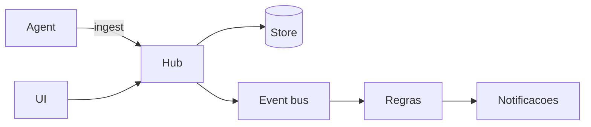

# Argus

Observabilidade de hosts e workloads Docker: métricas, logs, eventos, traces e painel web.

Hub central + agent leve por host. Persistência plugável (SQLite no default).

## Quickstart

Requisitos: Docker Engine com Compose v2.

```bash
git clone https://github.com/HarryRaddatz/argus-observability.git
cd argus-observability
cp .env.example .env
# Edite ARGUS_AGENT_TOKEN se quiser autenticar ingest
docker compose up -d --build
```

| Serviço | URL |
|---|---|
| Painel | http://localhost:3000 |
| Hub API | http://localhost:8080 |
| Health | http://localhost:8080/health |

O agent monta o Docker socket e passa a reportar containers em execução. Abra o painel e confira **Dashboard** e **Workloads**.

Exemplo mínimo adicional: [examples/compose-minimal/](examples/compose-minimal/).

## Componentes

| Binário | Função |
|---|---|
| `argus-hub` | API REST, WebSocket, bus de eventos, Store |
| `argus-agent` | Coleta métricas e logs do runtime; envia ao hub |



## Documentação

| Recurso | Arquivo |
|---|---|
| Mapa do produto | [docs/map.md](docs/map.md) |
| Roadmap biblioteca pública | [docs/public-library/roadmap.md](docs/public-library/roadmap.md) |
| API reference | [docs/api/](docs/api/) |
| Visão geral | [docs/overview.md](docs/overview.md) |
| Painel (rotas e IA) | [docs/flows/ui-panel.md](docs/flows/ui-panel.md) |
| Fluxos | [docs/flows/](docs/flows/) |

## Desenvolvimento local

```bash
go run ./cmd/hub
go run ./cmd/agent
cd web && npm install && npm run dev
```

O dev server Vite faz proxy de `/api` e `/health` para `http://127.0.0.1:8080`.

## Configuração

Variáveis principais — ver `.env.example` e [docs/api/configuration.md](docs/api/configuration.md).

## Contribuir

Leia [CONTRIBUTING.md](CONTRIBUTING.md) e [CODE_OF_CONDUCT.md](CODE_OF_CONDUCT.md).

## Licença

MIT — ver [LICENSE](LICENSE).
