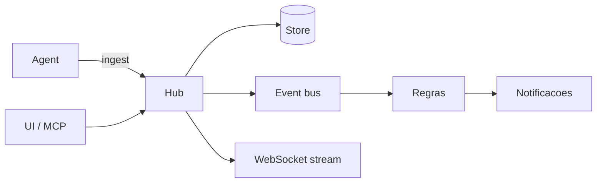

# Argus

Observabilidade de hosts e workloads: métricas, logs, eventos e consultas em tempo real.

Hub central + agent leve por host. Persistência plugável (SQLite no default).

## Componentes



| Binário | Função |
|---|---|
| `argus-hub` | API, WebSocket, bus de eventos, Store |
| `argus-agent` | Coleta métricas e logs do runtime; envia ao hub |

## Documentação

| Fluxo | Arquivo |
|---|---|
| Visão geral | [docs/overview.md](docs/overview.md) |
| Conexão agent ↔ hub | [docs/flows/agent-connection.md](docs/flows/agent-connection.md) |
| Ingestão de métricas | [docs/flows/metrics-ingestion.md](docs/flows/metrics-ingestion.md) |
| Stream de logs | [docs/flows/log-streaming.md](docs/flows/log-streaming.md) |
| Eventos e alertas | [docs/flows/events-and-alerts.md](docs/flows/events-and-alerts.md) |

## Desenvolvimento local

```bash
go run ./cmd/hub
go run ./cmd/agent
```

Ou com Docker:

```bash
cp .env.example .env
docker compose up -d --build
```

## Configuração

Variáveis principais — ver `.env.example`.

Commit ≠ deploy nesta VPS até existir pipeline de produção documentado em ops.
