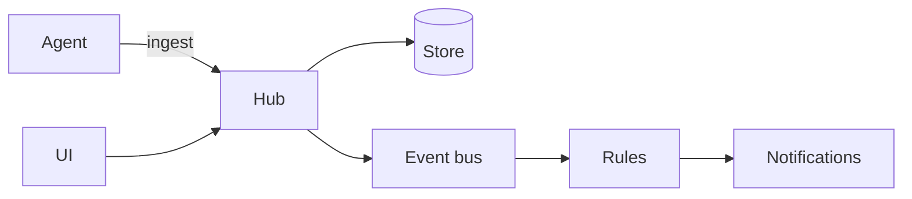

# Argus

[](https://github.com/HarryRaddatz/argus-observability/actions/workflows/ci.yml)

Observability for Docker hosts and workloads: metrics, logs, events, traces, and a web panel.

A central hub plus a light agent per host. Pluggable persistence (SQLite by default).

[Português](README.pt-BR.md)

## Quickstart

Requirements: Docker Engine with Compose v2.

```bash
git clone https://github.com/HarryRaddatz/argus-observability.git
cd argus-observability
cp .env.example .env
# Set ARGUS_AGENT_TOKEN if you want ingest authentication
docker compose up -d --build
```

| Service | URL |
|---|---|
| Panel | http://localhost:3000 |
| Hub API | http://localhost:8080 |
| Health | http://localhost:8080/health |

The agent mounts the Docker socket and starts reporting running containers. Open the panel and check **Overview** and **Containers**.

Additional minimal example: [examples/compose-minimal/](examples/compose-minimal/).

## Releases and images

Versions are on [GitHub Releases](https://github.com/HarryRaddatz/argus-observability/releases). Each `vX.Y.Z` tag publishes `argus-hub`, `argus-agent`, and `argus-web` for `linux/amd64` and `linux/arm64`, with tags `X.Y.Z`, `X.Y`, and `latest`:

| Registry | Images |
|---|---|
| Docker Hub | [`pseudohuery/argus-hub`](https://hub.docker.com/r/pseudohuery/argus-hub) · [`argus-agent`](https://hub.docker.com/r/pseudohuery/argus-agent) · [`argus-web`](https://hub.docker.com/r/pseudohuery/argus-web) |
| GHCR | `ghcr.io/harryraddatz/argus-{hub,agent,web}` |

To upgrade a running instance, follow [docs/deploy.md](docs/deploy.md).

## Components

| Binary | Role |
|---|---|
| `argus-hub` | REST API, WebSocket, event bus, Store |
| `argus-agent` | Collects runtime metrics and logs; sends them to the hub |


```mermaid
flowchart LR
  Agent[Agent] -->|ingest| Hub[Hub]
  Hub --> Store[(Store)]
  Hub --> Bus[Event bus]
  Bus --> Rules[Rules]
  Rules --> Notify[Notifications]
  UI[UI] --> Hub
```

## Documentation

Site: [harryraddatz.github.io/argus-observability](https://harryraddatz.github.io/argus-observability/) (English default; Portuguese via the language switcher).

| Resource | File |
|---|---|
| Product map | [docs/map.md](docs/map.md) |
| Public library roadmap | [docs/public-library/roadmap.md](docs/public-library/roadmap.md) |
| API reference | [docs/api/](docs/api/) |
| Overview | [docs/overview.md](docs/overview.md) |
| Panel (routes and IA) | [docs/flows/ui-panel.md](docs/flows/ui-panel.md) |
| Flows | [docs/flows/](docs/flows/) |
| Deploy and upgrades | [docs/deploy.md](docs/deploy.md) |

## Local development

```bash
go run ./cmd/hub
go run ./cmd/agent
cd web && npm install && npm run dev
```

The Vite dev server proxies `/api` and `/health` to `http://127.0.0.1:8080`.

## Configuration

Main variables — see `.env.example` and [docs/api/configuration.md](docs/api/configuration.md).

## Contributing

Read [CONTRIBUTING.md](CONTRIBUTING.md) and [CODE_OF_CONDUCT.md](CODE_OF_CONDUCT.md). Vulnerabilities: [SECURITY.md](SECURITY.md). Portuguese: [README.pt-BR.md](README.pt-BR.md), [CONTRIBUTING.pt-BR.md](CONTRIBUTING.pt-BR.md), [SECURITY.pt-BR.md](SECURITY.pt-BR.md).

## License

MIT — see [LICENSE](LICENSE).
