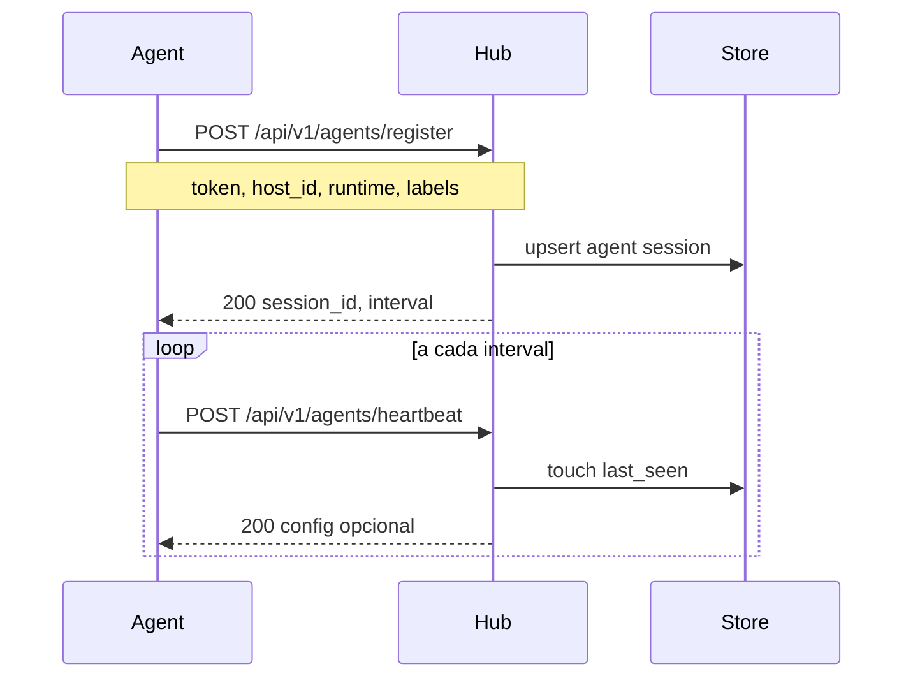
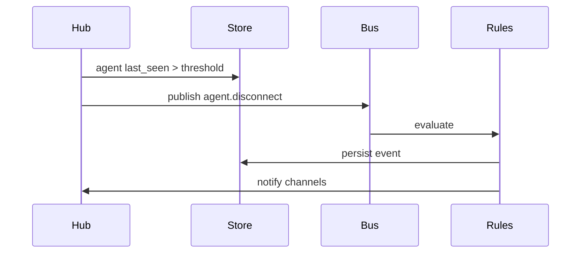

# Fluxo: conexão agent ↔ hub

O agent inicia a sessão com o hub. Em ambiente local pode usar HTTP direto; em produção, WebSocket TLS com token.

## Sequência — registro e heartbeat



## Sequência — desconexão detectada



## Modos de transporte

| Modo | Uso | Endpoint |
|---|---|---|
| HTTP | dev, LAN confiável | `ARGUS_HUB_URL` |
| WebSocket | stream contínuo de logs | `/api/v1/ws` |

## Autenticação

```
Authorization: Bearer <ARGUS_AGENT_TOKEN>
```

Token compartilhado por agent ou por host — configurável no hub.

## Falhas comuns

| Sintoma | Causa provável | Comportamento do agent |
|---|---|---|
| 401 | token inválido | para e loga erro |
| 503 | hub indisponível | backoff exponencial |
| timeout no ingest | hub saturado | backpressure local |
