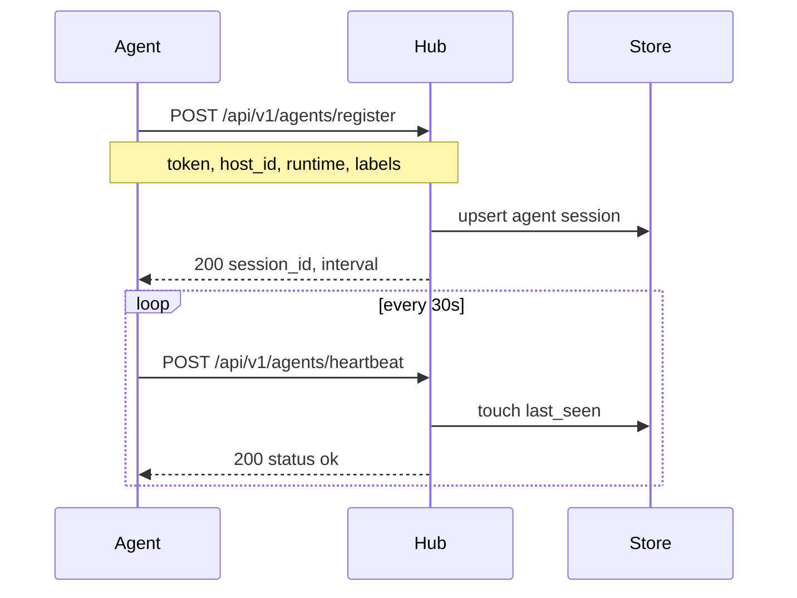
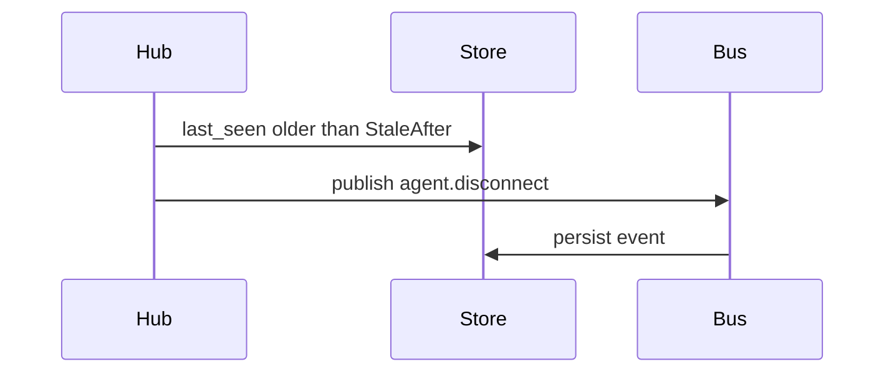

# Flow: agent ↔ hub connection

The agent starts the session with the hub over HTTP. There is no WebSocket on the hub.

## Sequence — register and heartbeat


```mermaid
sequenceDiagram
  participant Agent
  participant Hub
  participant Store

  Agent->>Hub: POST /api/v1/agents/register
  Note over Agent,Hub: token, host_id, runtime, labels
  Hub->>Store: upsert agent session
  Hub-->>Agent: 200 session_id, interval

  loop every 30s
    Agent->>Hub: POST /api/v1/agents/heartbeat
    Hub->>Store: touch last_seen
    Hub-->>Agent: 200 status ok
  end
```

## Sequence — detected disconnect


```mermaid
sequenceDiagram
  participant Hub
  participant Store
  participant Bus

  Hub->>Store: last_seen older than StaleAfter
  Hub->>Bus: publish agent.disconnect
  Bus->>Store: persist event
```

## Transport modes

| Mode | Use | Endpoint |
|---|---|---|
| HTTP | register, heartbeat, metrics, logs, fleet, events | `ARGUS_HUB_URL` |

## Authentication

```
Authorization: Bearer <ARGUS_AGENT_TOKEN>
```

Shared token per agent or per host — configured on the hub.

## Common failures

| Symptom | Likely cause | Agent behavior |
|---|---|---|
| 401 | invalid token | stops and logs an error |
| 503 | hub unavailable | exponential backoff |
| ingest timeout | hub saturated | local backpressure |
