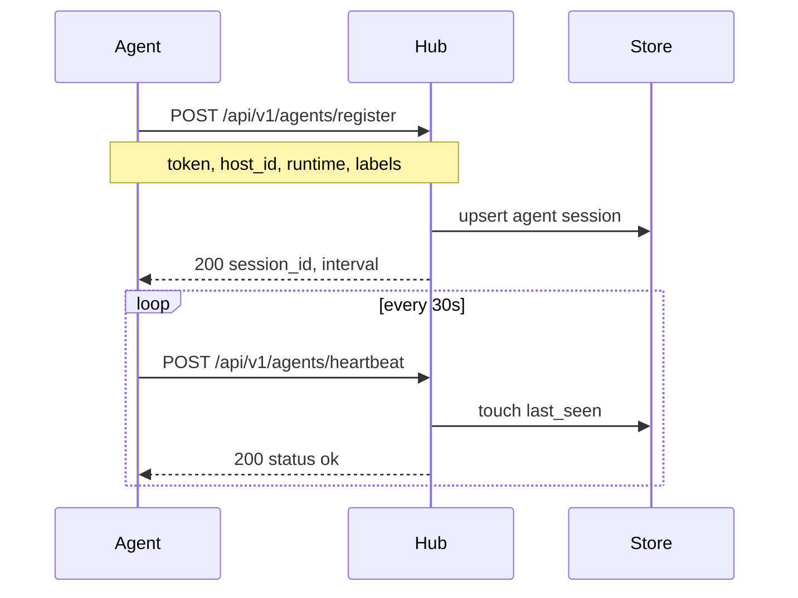
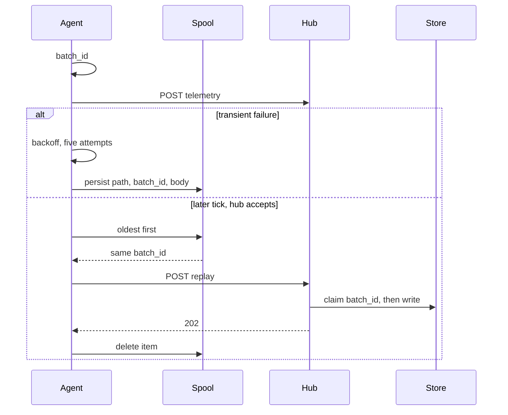
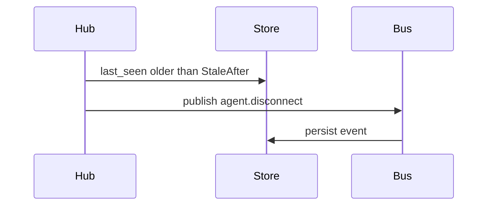

# Flow: agent ↔ hub connection

The agent starts the session with the hub over HTTP. There is no WebSocket on the hub.

## Sequence — register and heartbeat


```mermaid
sequenceDiagram
  participant Agent
  participant Hub
  participant Store

  Agent->>Hub: POST /api/v1/agents/register
  Note over Agent,Hub: token, host_id, runtime, labels
  Hub->>Store: upsert agent session
  Hub-->>Agent: 200 session_id, interval

  loop every 30s
    Agent->>Hub: POST /api/v1/agents/heartbeat
    Hub->>Store: touch last_seen
    Hub-->>Agent: 200 status ok
  end
```

## Sequence — batch that the hub does not accept


```mermaid
sequenceDiagram
  participant Agent
  participant Spool
  participant Hub
  participant Store

  Agent->>Agent: batch_id
  Agent->>Hub: POST telemetry
  alt transient failure
    Agent->>Agent: backoff, five attempts
    Agent->>Spool: persist path, batch_id, body
  else later tick, hub accepts
    Agent->>Spool: oldest first
    Spool-->>Agent: same batch_id
    Agent->>Hub: POST replay
    Hub->>Store: claim batch_id, then write
    Hub-->>Agent: 202
    Agent->>Spool: delete item
  end
```

A lost 202 is safe: the replay sends the same `batch_id`, and the hub does not write the rows again.

## Sequence — detected disconnect


```mermaid
sequenceDiagram
  participant Hub
  participant Store
  participant Bus

  Hub->>Store: last_seen older than StaleAfter
  Hub->>Bus: publish agent.disconnect
  Bus->>Store: persist event
```

## Transport modes

| Mode | Use | Endpoint |
|---|---|---|
| HTTP | register, heartbeat, metrics, logs, fleet, events | `ARGUS_HUB_URL` |

## Authentication

```
Authorization: Bearer <ARGUS_AGENT_TOKEN>
```

Shared token per agent or per host — configured on the hub. Telemetry posts send `X-Argus-Batch-Id`. The same id is reused on retry and replay.

## Common failures

| Symptom | Likely cause | Agent behavior |
|---|---|---|
| 401, 403, or another 4xx except 429 | request rejected | fails that post immediately. Register exits; a batch is logged and dropped |
| 429, 5xx, connection error, or timeout | hub busy or unreachable | up to 5 attempts, backoff from about 250ms doubling to 8s with jitter. If the hub is still down, the batch is stored and sent before newer batches. A later 401, 403, or other 4xx drops that stored batch |
