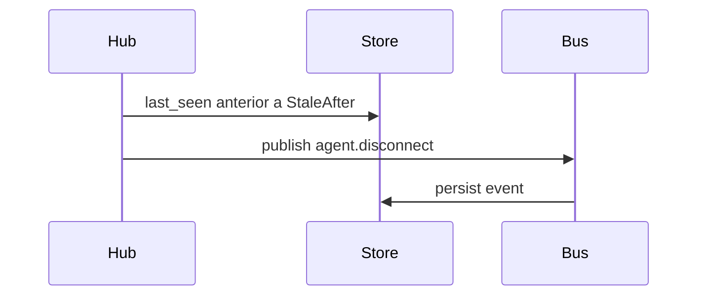

# Fluxo: conexão agent ↔ hub

O agent inicia a sessão com o hub por HTTP. Não há WebSocket no hub.

## Sequência — registro e heartbeat


```mermaid
sequenceDiagram
  participant Agent
  participant Hub
  participant Store

  Agent->>Hub: POST /api/v1/agents/register
  Note over Agent,Hub: token, host_id, runtime, labels
  Hub->>Store: upsert agent session
  Hub-->>Agent: 200 session_id, interval

  loop a cada 30s
    Agent->>Hub: POST /api/v1/agents/heartbeat
    Hub->>Store: touch last_seen
    Hub-->>Agent: 200 status ok
  end
```

## Sequência — desconexão detectada


```mermaid
sequenceDiagram
  participant Hub
  participant Store
  participant Bus

  Hub->>Store: last_seen anterior a StaleAfter
  Hub->>Bus: publish agent.disconnect
  Bus->>Store: persist event
```

## Modos de transporte

| Modo | Uso | Endpoint |
|---|---|---|
| HTTP | registro, heartbeat, métricas, logs, fleet, eventos | `ARGUS_HUB_URL` |

## Autenticação

```
Authorization: Bearer <ARGUS_AGENT_TOKEN>
```

Token compartilhado por agent ou por host — configurável no hub.

## Falhas comuns

| Sintoma | Causa provável | Comportamento do agent |
|---|---|---|
| 401 | token inválido | para e loga erro |
| 503 | hub indisponível | backoff exponencial |
| timeout no ingest | hub saturado | backpressure local |
