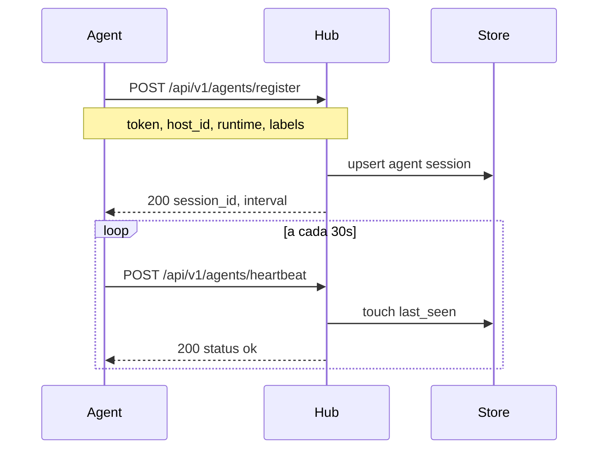
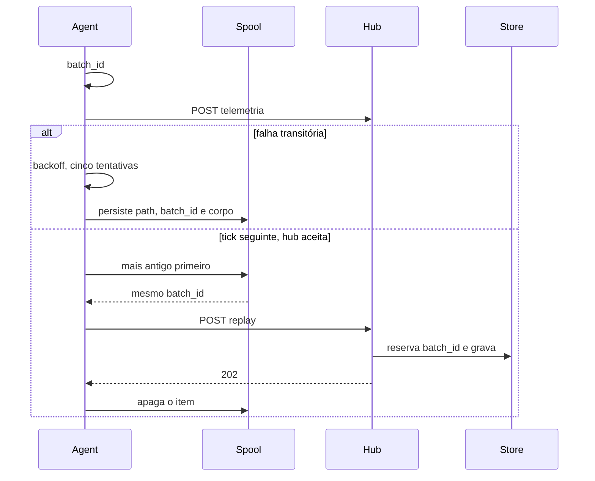
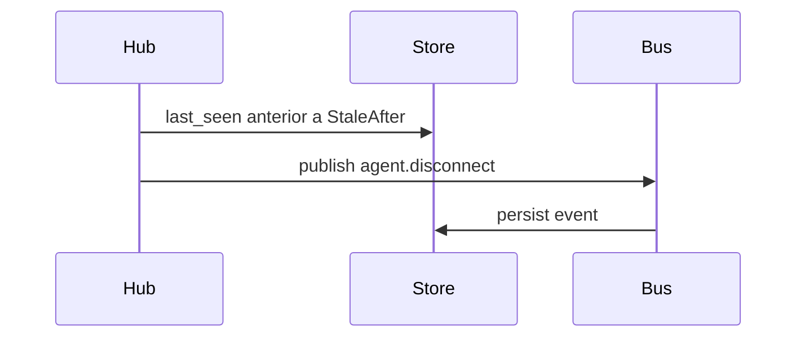

# Fluxo: conexão agent ↔ hub

O agent inicia a sessão com o hub por HTTP. Não há WebSocket no hub.

## Sequência — registro e heartbeat



## Sequência — lote que o hub não aceita



Um 202 perdido é seguro: o replay manda o mesmo `batch_id` e o hub não grava as linhas de novo.

## Sequência — desconexão detectada



## Modos de transporte

| Modo | Uso | Endpoint |
|---|---|---|
| HTTP | registro, heartbeat, métricas, logs, fleet, eventos | `ARGUS_HUB_URL` |

## Autenticação

```
Authorization: Bearer <ARGUS_AGENT_TOKEN>
```

Token compartilhado por agent ou por host — configurável no hub. Os POST de telemetria enviam `X-Argus-Batch-Id`. O mesmo id vale no retry e no replay.

## Falhas comuns

| Sintoma | Causa provável | Comportamento do agent |
|---|---|---|
| 401, 403 ou outro 4xx exceto 429 | request recusado | falha o POST na hora. O registro encerra o processo; um lote é logado e descartado |
| 429, 5xx, erro de conexão ou timeout | hub ocupado ou fora | até 5 tentativas, backoff de cerca de 250ms dobrando até 8s com jitter. Se o hub continuar fora, o lote fica em disco e sai antes dos lotes novos. Um 401, 403 ou outro 4xx no reenvio descarta esse lote |
