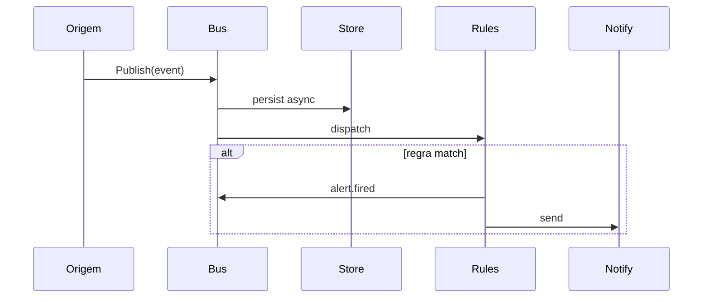
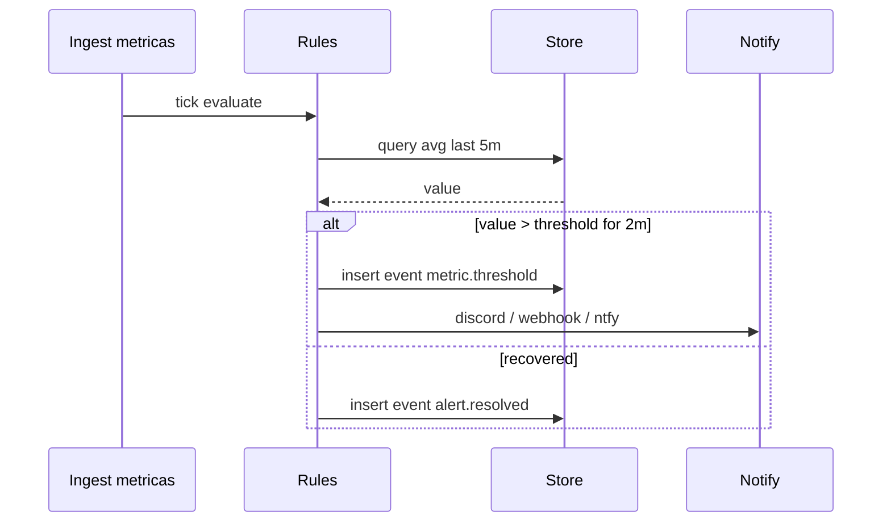
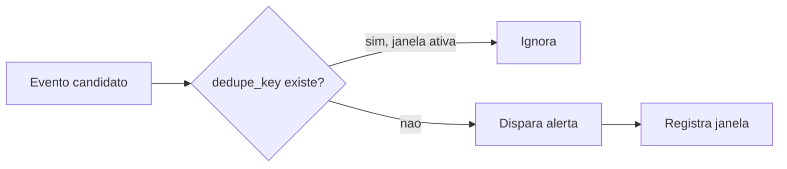
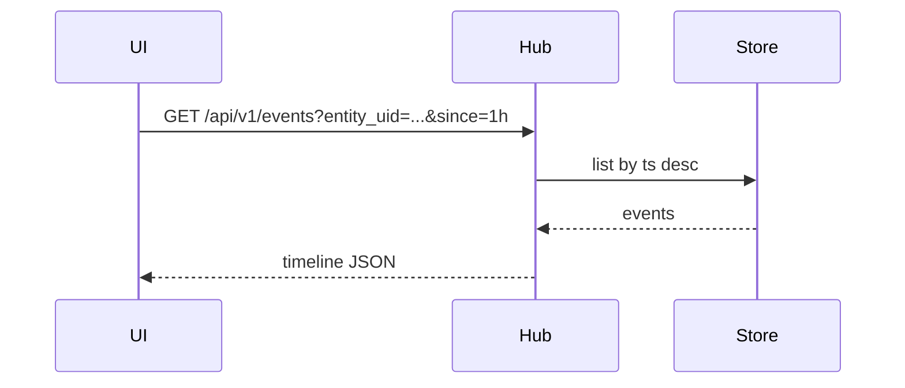

# Fluxo: eventos e alertas

Eventos tipados circulam no bus interno. Regras avaliam condições e disparam notificações com deduplicação.

## Envelope de evento

```json
{
  "id": "evt_01J...",
  "type": "metric.threshold",
  "ts": "2026-09-03T13:00:00Z",
  "severity": "warning",
  "source": "rule-engine",
  "entity_uid": "docker:host-01:api",
  "labels": { "host": "host-01", "rule": "cpu-high" },
  "payload": { "metric": "cpu.usage", "value": 92.1, "threshold": 90 }
}
```

## Sequência — publicação no bus



## Sequência — regra de limiar



## Deduplicação



## Catálogo de tipos (v1)

| type | severity típica |
|---|---|
| `agent.disconnect` | warning |
| `agent.backpressure` | warning |
| `metric.threshold` | warning / critical |
| `resource.pressure` | warning |
| `container.oom` | critical |
| `container.restart` | info |
| `log.pattern` | warning |
| `alert.fired` | info |
| `alert.resolved` | info |
| `notify.failed` | warning |

## Timeline na UI



## Notificações

Fan-out assíncrono com retry. Falha gera `notify.failed` no bus.

Canais v1: webhook genérico (JSON template).
