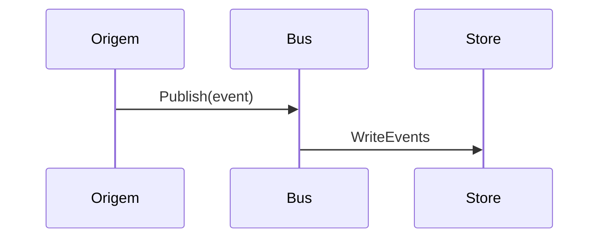
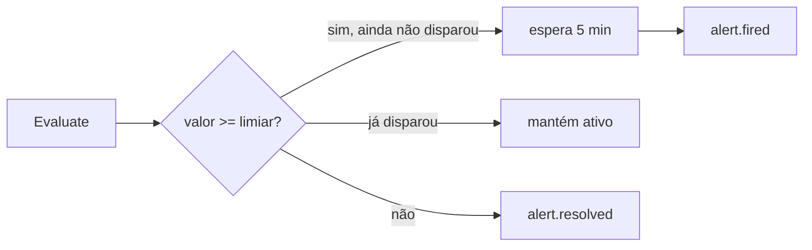
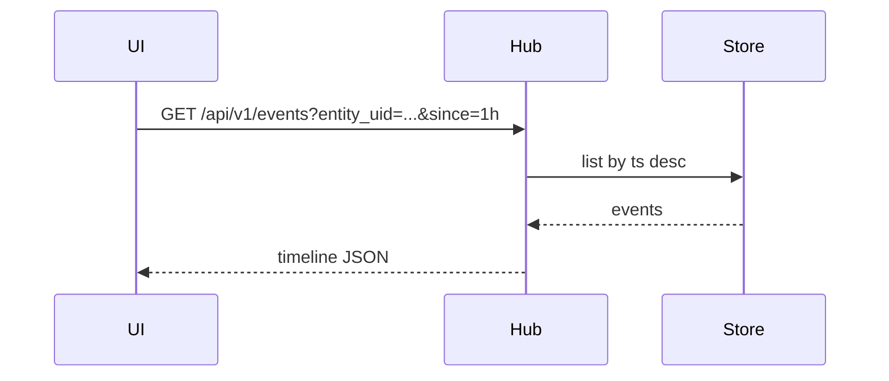

# Fluxo: eventos e alertas

Eventos tipados circulam no bus interno. Regras avaliam condições e disparam notificações com deduplicação.

## Envelope de evento

```json
{
  "id": "evt_01J...",
  "type": "metric.threshold",
  "ts": "2026-09-03T13:00:00Z",
  "severity": "warning",
  "source": "rule-engine",
  "entity_uid": "docker:host-01:api",
  "labels": { "host": "host-01", "rule": "cpu-high" },
  "payload": { "metric": "cpu.usage", "value": 92.1, "threshold": 90 }
}
```

## Sequência — publicação no bus


```mermaid
sequenceDiagram
  participant Source as Origem
  participant Bus
  participant Store

  Source->>Bus: Publish(event)
  Bus->>Store: WriteEvents
```

## Sequência — regra de limiar

```mermaid
sequenceDiagram
  participant Loop as rulesLoop 30s
  participant Rules
  participant Store
  participant Bus

  Loop->>Rules: Evaluate
  Rules->>Store: ListWorkloads since 10m
  Store-->>Rules: cpu e memória
  alt acima do limiar por 5m
    Rules->>Bus: alert.fired e metric.threshold
  else valor voltou
    Rules->>Bus: alert.resolved
  end
  Bus->>Store: persist event
```

## Deduplicação

A chave é `rule_id` + `entity_uid`. O alerta dispara uma vez depois de 5 minutos acima do limiar e só resolve quando o valor cai. O campo `dedupe` de 5 minutos no engine não é consultado.


```mermaid
flowchart LR
  Tick[Evaluate] --> Above{valor >= limiar?}
  Above -->|sim, ainda não disparou| Wait[espera 5 min]
  Wait --> Fire[alert.fired]
  Above -->|já disparou| Keep[mantém ativo]
  Above -->|não| Resolve[alert.resolved]
```

## Catálogo de tipos (v1)

| type | severity típica | Origem |
|---|---|---|
| `agent.register` | info | hub |
| `agent.reconnect` | info | hub |
| `agent.disconnect` | warning | hub (`staleLoop`) |
| `metric.threshold` | warning / critical | rule engine |
| `alert.fired` | a da regra | rule engine |
| `alert.resolved` | info | rule engine |
| `resource.pressure` | warning | hub, na ingestão de métricas |
| `slo.budget_low` | warning | avaliador de SLO (60 s) |
| `container.start` | info | agent |
| `container.die` | info ou warning | agent |
| `container.oom` | critical | agent |
| `container.restart` | warning | agent |
| `container.pause`, `unpause`, `destroy`, `rename` | info | agent |

## Timeline na UI


```mermaid
sequenceDiagram
  participant UI
  participant Hub
  participant Store

  UI->>Hub: GET /api/v1/events?entity_uid=...&since=1h
  Hub->>Store: list by ts desc
  Store-->>Hub: events
  Hub-->>UI: timeline JSON
```

## Notificações

O hub não envia webhook. Alerta ativo sai em `GET /api/v1/alerts/active` e o evento fica em `GET /api/v1/events`.
