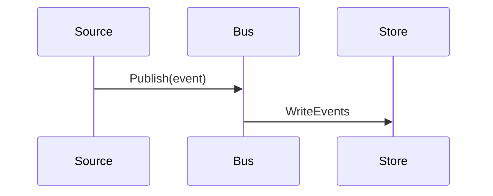
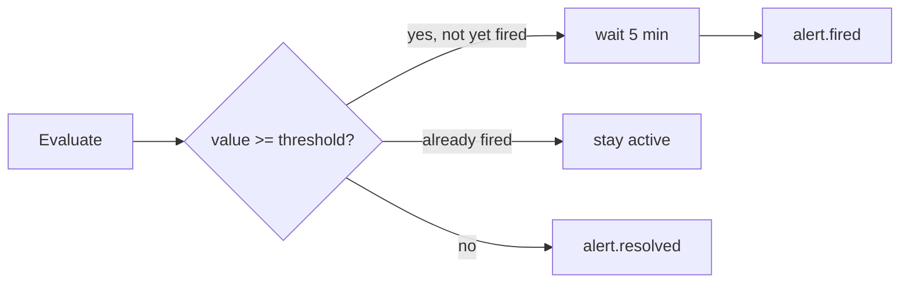
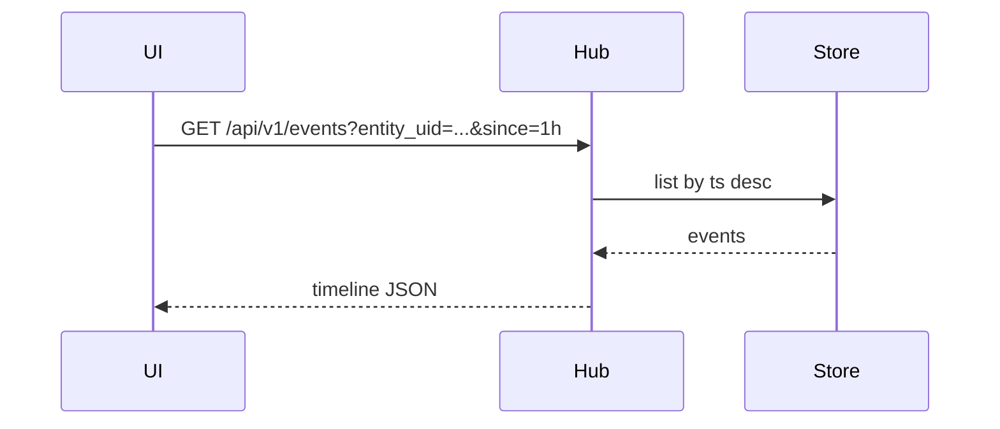

# Flow: events and alerts

Typed events travel on the internal bus. Rules evaluate conditions and fire notifications with deduplication.

## Event envelope

```json
{
  "id": "evt_01J...",
  "type": "metric.threshold",
  "ts": "2026-09-03T13:00:00Z",
  "severity": "warning",
  "source": "rule-engine",
  "entity_uid": "docker:host-01:api",
  "labels": { "host": "host-01", "rule": "cpu-high" },
  "payload": { "metric": "cpu.usage", "value": 92.1, "threshold": 90 }
}
```

## Sequence — publish on the bus


```mermaid
sequenceDiagram
  participant Source
  participant Bus
  participant Store

  Source->>Bus: Publish(event)
  Bus->>Store: WriteEvents
```

## Sequence — threshold rule

```mermaid
sequenceDiagram
  participant Loop as rulesLoop 30s
  participant Rules
  participant Store
  participant Bus

  Loop->>Rules: Evaluate
  Rules->>Store: ListWorkloads since 10m
  Store-->>Rules: cpu and memory
  alt above threshold for 5m
    Rules->>Bus: alert.fired and metric.threshold
  else value recovered
    Rules->>Bus: alert.resolved
  end
  Bus->>Store: persist event
```

## Deduplication

The key is `rule_id` + `entity_uid`. The alert fires once after 5 minutes above the threshold and only resolves when the value drops. The engine's 5-minute `dedupe` field is not queried.


```mermaid
flowchart LR
  Tick[Evaluate] --> Above{value >= threshold?}
  Above -->|yes, not yet fired| Wait[wait 5 min]
  Wait --> Fire[alert.fired]
  Above -->|already fired| Keep[stay active]
  Above -->|no| Resolve[alert.resolved]
```

## Type catalog (v1)

| type | typical severity | Source |
|---|---|---|
| `agent.register` | info | hub |
| `agent.reconnect` | info | hub |
| `agent.disconnect` | warning | hub (`staleLoop`) |
| `metric.threshold` | warning / critical | rule engine |
| `alert.fired` | the rule's severity | rule engine |
| `alert.resolved` | info | rule engine |
| `resource.pressure` | warning | hub, on metrics ingest |
| `slo.budget_low` | warning | SLO evaluator (60 s) |
| `container.start` | info | agent |
| `container.die` | info or warning | agent |
| `container.oom` | critical | agent |
| `container.restart` | warning | agent |
| `container.pause`, `unpause`, `destroy`, `rename` | info | agent |

## Timeline in the UI


```mermaid
sequenceDiagram
  participant UI
  participant Hub
  participant Store

  UI->>Hub: GET /api/v1/events?entity_uid=...&since=1h
  Hub->>Store: list by ts desc
  Store-->>Hub: events
  Hub-->>UI: timeline JSON
```

## Notifications

The hub does not send webhooks. Active alerts come from `GET /api/v1/alerts/active` and the event stays in `GET /api/v1/events`.
