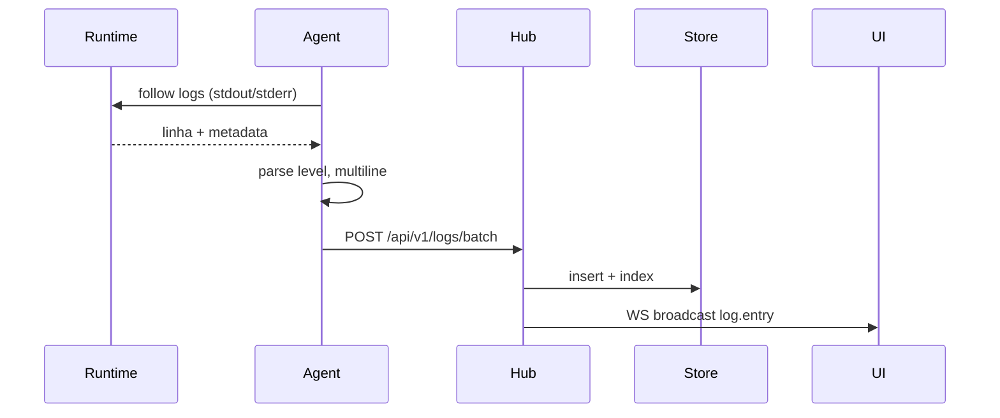
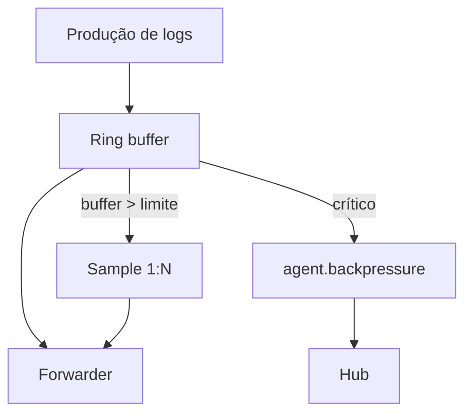
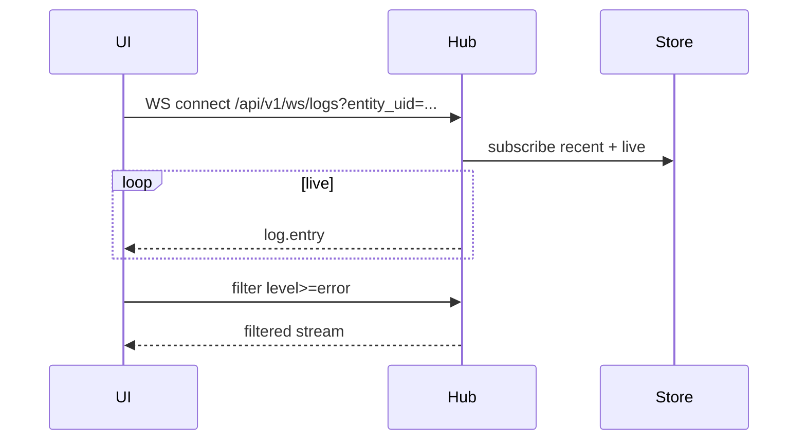
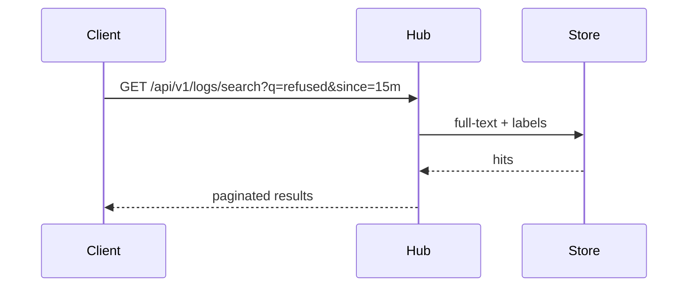

# Fluxo: stream de logs

Logs seguem do runtime ao hub e daí para clientes WebSocket. Sob pressão, o agent aplica backpressure antes de saturar o host.

## Sequência — tail contínuo



## Backpressure



| Estágio | Ação |
|---|---|
| buffer < 70% | envio normal |
| 70–90% | sample 1:5 |
| > 90% | sample 1:10 + evento |

## Formato de entrada

```json
{
  "ts": "2026-09-03T13:00:01Z",
  "message": "level=error msg=connection refused",
  "level": "error",
  "entity_uid": "docker:host-01:api",
  "labels": { "host": "host-01", "container": "api" },
  "fields": { "trace_id": "abc" }
}
```

## Sequência — UI tail ao vivo



## Busca histórica


