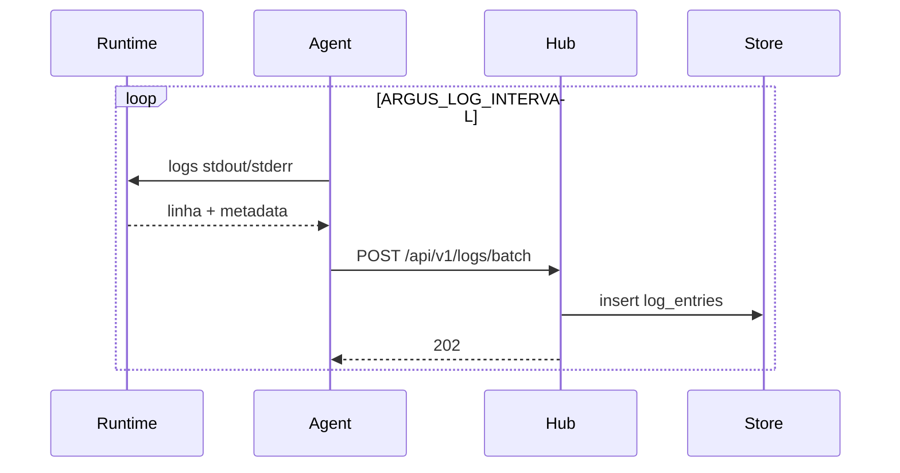
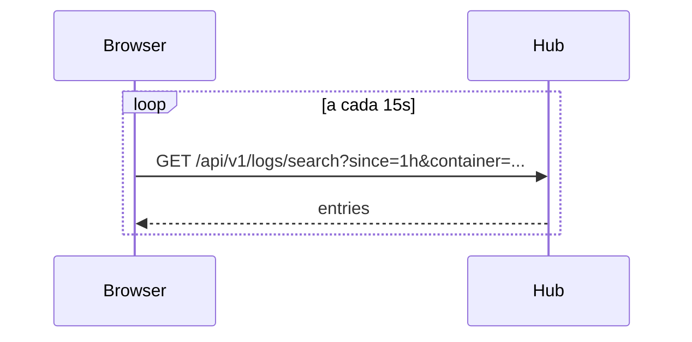
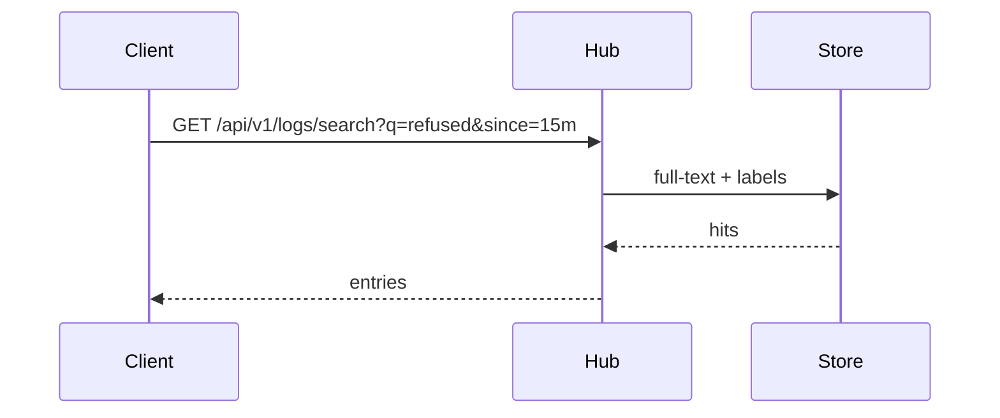

# Fluxo: stream de logs

O agent lê logs do Docker no intervalo `ARGUS_LOG_INTERVAL` e envia um lote HTTP. O painel consulta o hub; não há stream WebSocket nem amostragem por pressão.

## Sequência — coleta e persistência


```mermaid
sequenceDiagram
  participant Runtime
  participant Agent
  participant Hub
  participant Store

  loop ARGUS_LOG_INTERVAL
    Agent->>Runtime: logs stdout/stderr
    Runtime-->>Agent: linha + metadata
    Agent->>Hub: POST /api/v1/logs/batch
    Hub->>Store: insert log_entries
    Hub-->>Agent: 202
  end
```

O hub não expõe WebSocket. O painel relê a busca.

## Formato de entrada

```json
{
  "ts": "2026-09-03T13:00:01Z",
  "message": "level=error msg=connection refused",
  "level": "error",
  "entity_uid": "docker:host-01:api",
  "labels": { "host": "host-01", "container": "api" },
  "fields": { "trace_id": "abc" }
}
```

## Sequência — painel

`/logs` consulta a cada 15 s (`web/src/pages/logs.tsx`). Não há rota `/api/v1/ws`.


```mermaid
sequenceDiagram
  participant Browser
  participant Hub

  loop a cada 15s
    Browser->>Hub: GET /api/v1/logs/search?since=1h&container=...
    Hub-->>Browser: entries
  end
```

## Busca histórica


```mermaid
sequenceDiagram
  participant Client
  participant Hub
  participant Store

  Client->>Hub: GET /api/v1/logs/search?q=refused&since=15m
  Hub->>Store: full-text + labels
  Store-->>Hub: hits
  Hub-->>Client: entries
```
