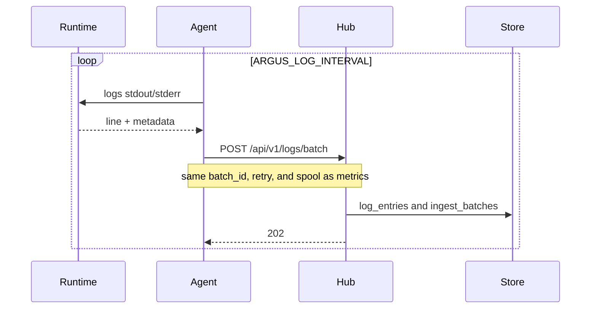
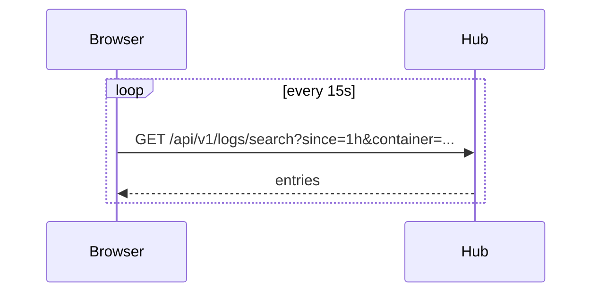
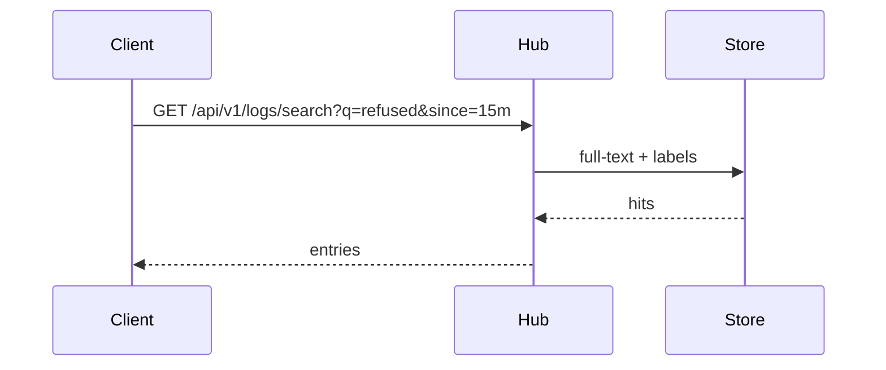

# Flow: log stream

The agent reads Docker logs on `ARGUS_LOG_INTERVAL` and sends an HTTP batch. The panel queries the hub; there is no WebSocket stream and no sampling under pressure.

## Sequence — collect and persist


```mermaid
sequenceDiagram
  participant Runtime
  participant Agent
  participant Hub
  participant Store

  loop ARGUS_LOG_INTERVAL
    Agent->>Runtime: logs stdout/stderr
    Runtime-->>Agent: line + metadata
    Agent->>Hub: POST /api/v1/logs/batch
    Note over Agent,Hub: same batch_id, retry, and spool as metrics
    Hub->>Store: log_entries and ingest_batches
    Hub-->>Agent: 202
  end
```

The hub does not expose WebSocket. The panel re-runs search.

## Input format

```json
{
  "ts": "2026-09-03T13:00:01Z",
  "message": "level=error msg=connection refused",
  "level": "error",
  "entity_uid": "docker:host-01:api",
  "labels": { "host": "host-01", "container": "api" },
  "fields": { "trace_id": "abc" }
}
```

## Sequence — panel

`/logs` polls every 15 s (`web/src/pages/logs.tsx`). There is no `/api/v1/ws` route.


```mermaid
sequenceDiagram
  participant Browser
  participant Hub

  loop every 15s
    Browser->>Hub: GET /api/v1/logs/search?since=1h&container=...
    Hub-->>Browser: entries
  end
```

## Historical search


```mermaid
sequenceDiagram
  participant Client
  participant Hub
  participant Store

  Client->>Hub: GET /api/v1/logs/search?q=refused&since=15m
  Hub->>Store: full-text + labels
  Store-->>Hub: hits
  Hub-->>Client: entries
```
