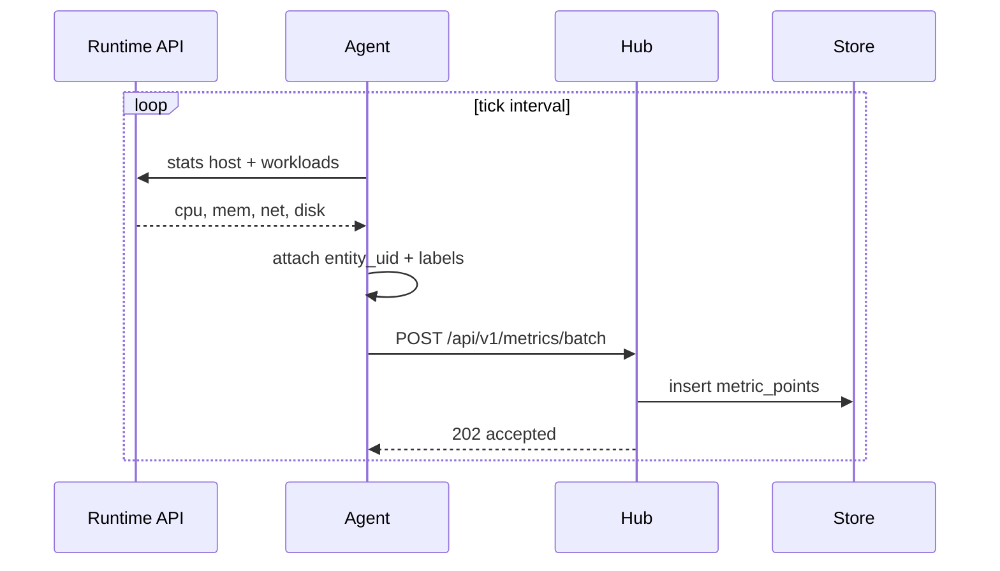
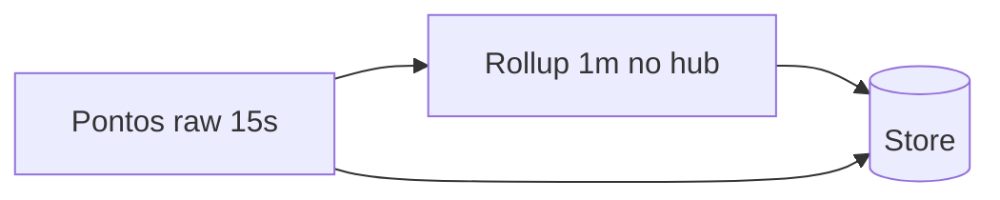
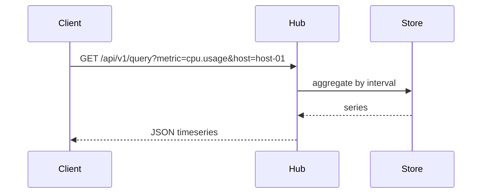

# Fluxo: ingestão de métricas

O agent consulta o runtime a cada intervalo, normaliza pontos genéricos e envia em lote ao hub.

## Sequência — coleta e persistência



## Formato de ponto

```json
{
  "metric_name": "cpu.usage",
  "ts": "2026-09-03T13:00:00Z",
  "value": 42.5,
  "entity_uid": "docker:host-01:api",
  "labels": {
    "host": "host-01",
    "runtime": "docker",
    "container": "api"
  }
}
```

## Downsample



Retenção configurável: raw curto, rollup longo.

## Consulta (UI / MCP)



## Métricas host (v1)

| metric_name | Descrição |
|---|---|
| `cpu.usage` | % uso CPU |
| `memory.usage` | bytes ou % |
| `memory.limit` | limite cgroup |
| `disk.usage` | bytes usados |
| `network.rx` / `network.tx` | bytes/s |
| `load.1m` | load average |

## Métricas workload

| metric_name | Descrição |
|---|---|
| `cpu.usage` | % do container/pod |
| `memory.usage` | bytes |
| `memory.limit` | bytes |
