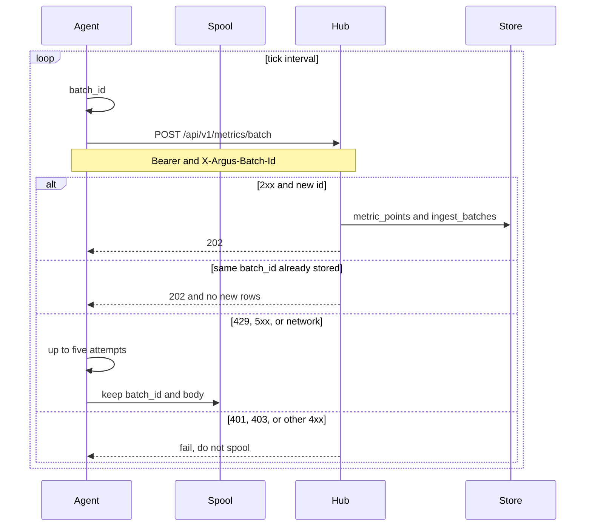
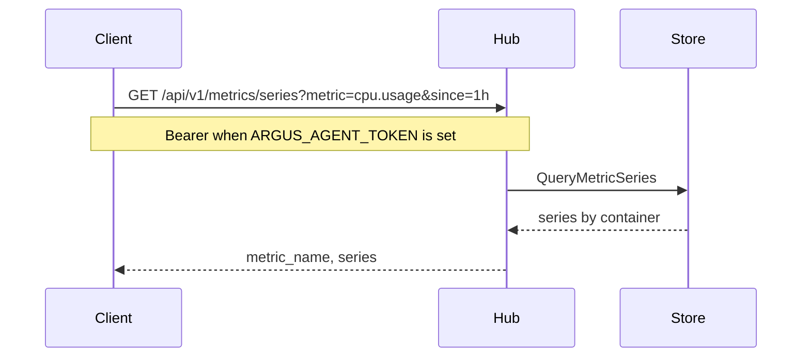

# Flow: metrics ingest

The agent queries the runtime on an interval, normalizes generic points, and sends them to the hub in batches.

## Sequence — collect and persist


```mermaid
sequenceDiagram
  participant Agent
  participant Spool
  participant Hub
  participant Store

  loop tick interval
    Agent->>Agent: batch_id
    Agent->>Hub: POST /api/v1/metrics/batch
    Note over Agent,Hub: Bearer and X-Argus-Batch-Id
    alt 2xx and new id
      Hub->>Store: metric_points and ingest_batches
      Hub-->>Agent: 202
    else same batch_id already stored
      Hub-->>Agent: 202 and no new rows
    else 429, 5xx, or network
      Agent->>Agent: up to five attempts
      Agent->>Spool: keep batch_id and body
    else 401, 403, or other 4xx
      Hub-->>Agent: fail, do not spool
    end
  end
```

On the next tick the agent replays the spool, oldest first, before the new batch. Each replay uses its own timeout. Register and heartbeat are not spooled.

## Point format

```json
{
  "metric_name": "cpu.usage",
  "ts": "2026-09-03T13:00:00Z",
  "value": 42.5,
  "entity_uid": "docker:host-01:api",
  "labels": {
    "host": "host-01",
    "runtime": "docker",
    "container": "api"
  }
}
```

The hub stores points as they arrive and derives `memory.usage_pct` when the batch includes usage and limit. There is no rollup.

## Query


```mermaid
sequenceDiagram
  participant Client
  participant Hub
  participant Store

  Client->>Hub: GET /api/v1/metrics/series?metric=cpu.usage&since=1h
  Note over Client,Hub: Bearer when ARGUS_AGENT_TOKEN is set
  Hub->>Store: QueryMetricSeries
  Store-->>Hub: series by container
  Hub-->>Client: metric_name, series
```

`GET /api/v1/query?metric=cpu.usage&since=1h` returns the flattened series (`metric_name`, `points`). There is no `host` filter.

## Agent metrics

| metric_name | Description |
|---|---|
| `cpu.usage` | container CPU % |
| `memory.usage` | bytes |
| `memory.limit` | cgroup bytes |
| `memory.usage_pct` | derived on the hub |
| `network.rx` / `network.tx` | bytes/s |
| `block.read` / `block.write` | bytes/s |
