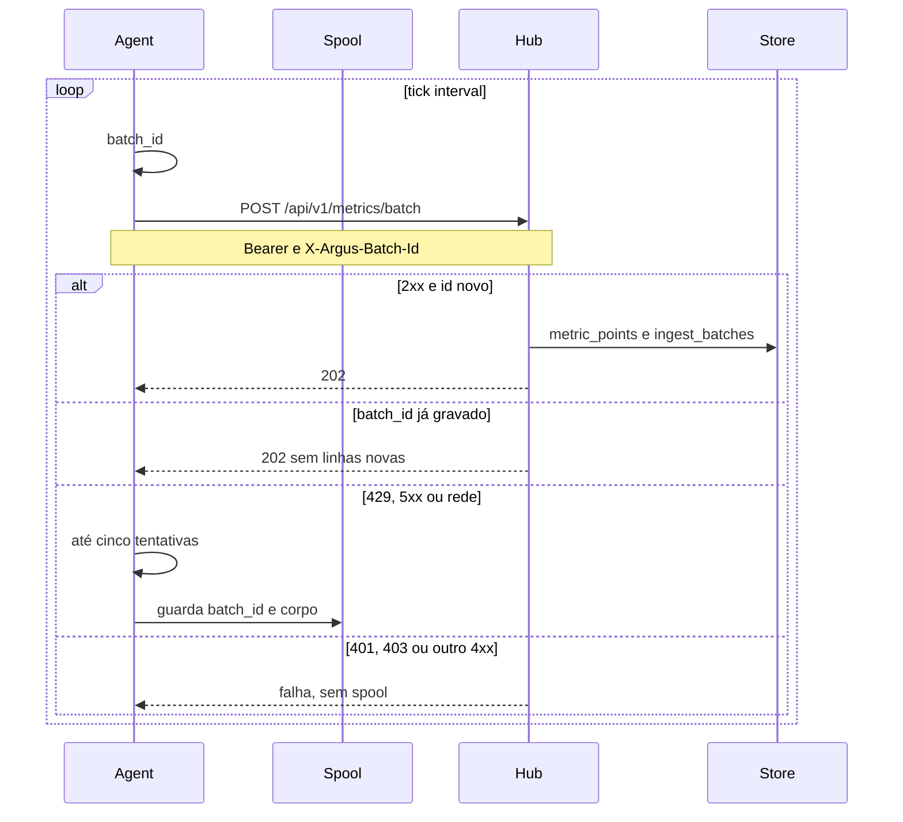
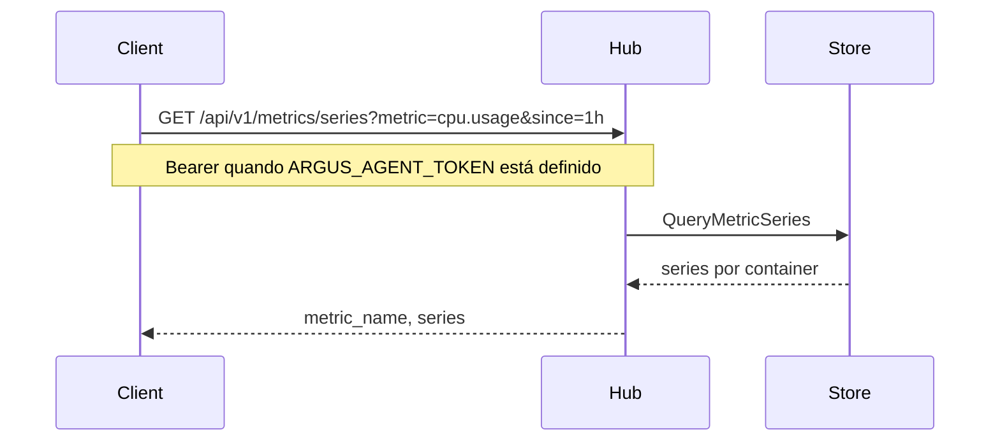

# Fluxo: ingestão de métricas

O agent consulta o runtime a cada intervalo, normaliza pontos genéricos e envia em lote ao hub.

## Sequência — coleta e persistência



No tick seguinte o agent reenvia o spool, do mais antigo para o mais novo, antes do lote novo. Cada replay tem o próprio timeout. Registro e heartbeat não entram no spool.

## Formato de ponto

```json
{
  "metric_name": "cpu.usage",
  "ts": "2026-09-03T13:00:00Z",
  "value": 42.5,
  "entity_uid": "docker:host-01:api",
  "labels": {
    "host": "host-01",
    "runtime": "docker",
    "container": "api"
  }
}
```

O hub grava os pontos como chegam e deriva `memory.usage_pct` quando o lote traz uso e limite. Não há rollup.

## Consulta



`GET /api/v1/query?metric=cpu.usage&since=1h` devolve a série achatada (`metric_name`, `points`). Não há filtro `host`.

## Métricas do agent

| metric_name | Descrição |
|---|---|
| `cpu.usage` | % de CPU do container |
| `memory.usage` | bytes |
| `memory.limit` | bytes do cgroup |
| `memory.usage_pct` | derivada no hub |
| `network.rx` / `network.tx` | bytes/s |
| `block.read` / `block.write` | bytes/s |
