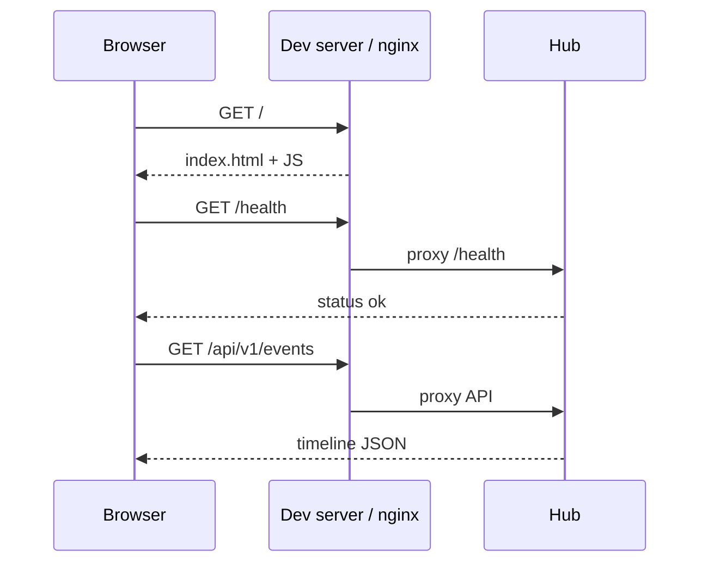
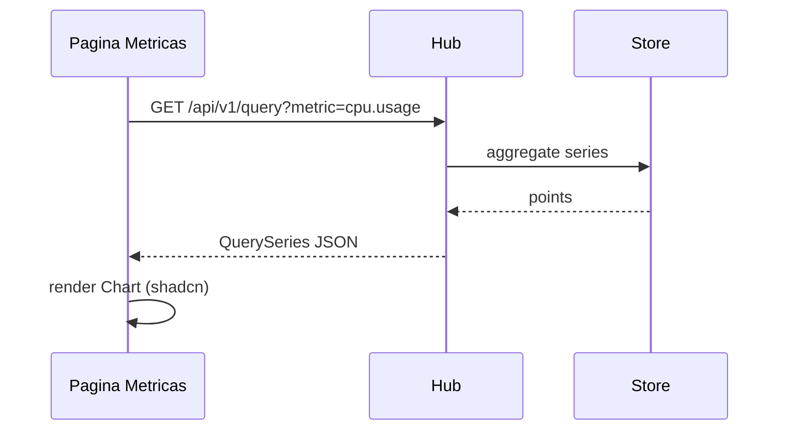
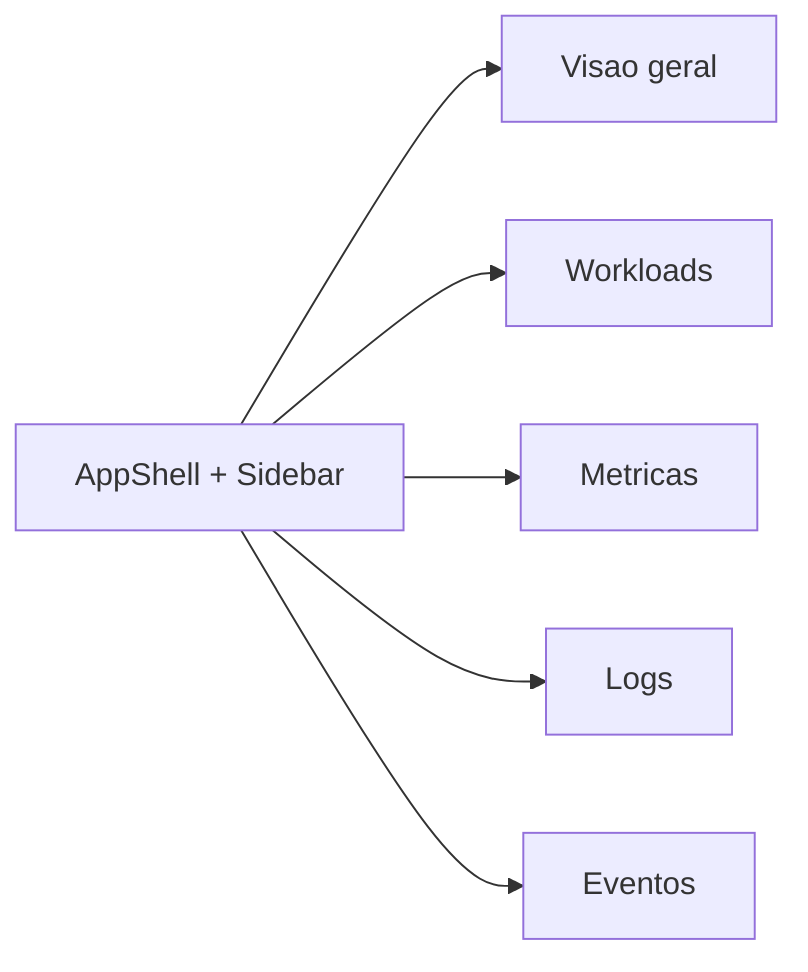
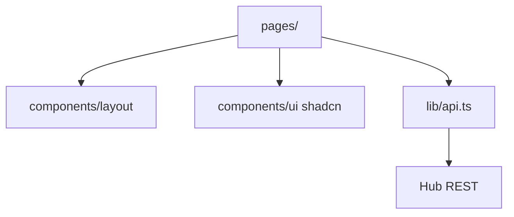

# Fluxo: painel de gestão

O painel é uma SPA React que consome a API do hub. Componentes visuais exclusivamente shadcn/ui.

## Sequência — carregamento inicial

## Sequência — métricas no gráfico

## Mapa de rotas

## Camadas da UI

## Tema claro / escuro

Variáveis `:root` e `.dark` em `web/src/index.css`. Toggle de tema pode ser adicionado via `next-themes` ou classe no `documentElement` — padrão shadcn.
