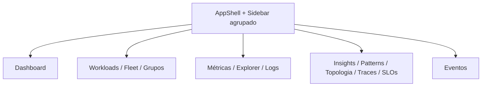
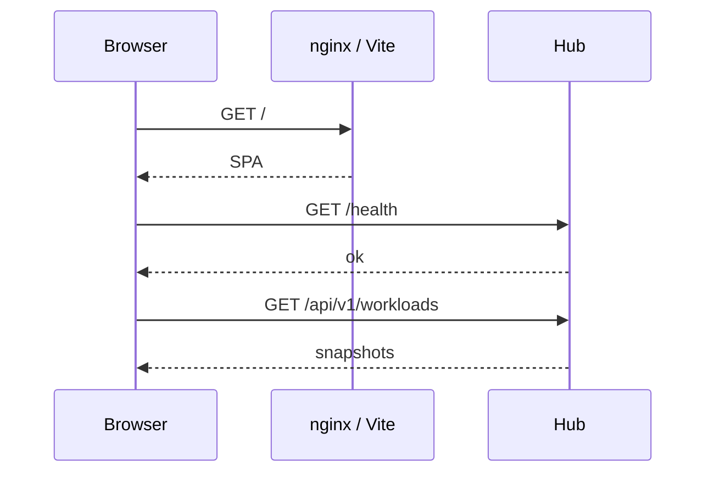

# Fluxo: painel de gestão

SPA React (`web/`) consumindo a API do hub. Componentes shadcn/ui.

## Arquitetura de informação

Navegação agrupada por domínio (`web/src/lib/navigation.ts`):

| Grupo | Rotas |
|---|---|
| Visão | Dashboard (`/`) |
| Infraestrutura | Workloads, Fleet, Grupos |
| Telemetria | Métricas, Explorer, Logs |
| Análise | Insights, Patterns, Topologia, Traces, SLOs |
| Alertas | Eventos |

Header global exibe grupo + título da rota ativa (`app-shell.tsx`).

## Mapa de rotas

Todas as 13 rotas permanecem estáveis (URLs inalteradas).

## Layout de página

Componente `PageHeader`: título, descrição, breadcrumb opcional, slot de ações (período, toggles).

Páginas principais:

- **Dashboard** — hub com cards por domínio (infra, HTTP, análise)
- **Workloads** — grid com meters/sparklines + tabela; chart CPU empilhado
- **Métricas** — layout 2 colunas em desktop; meters CPU/mem
- **Explorer** — multi-série com toggle média/máx

## Sequência — carregamento

## Dev

Proxy Vite: `/api` e `/health` → hub (`web/vite.config.ts`).

Build produção: `npm run build` — artefatos servidos pelo container `argus-web`.

## Referências

- Layout: `web/src/components/layout/`
- Métricas UI: `web/src/components/metrics/`
- Mapa produto: [../map.md](../map.md)
