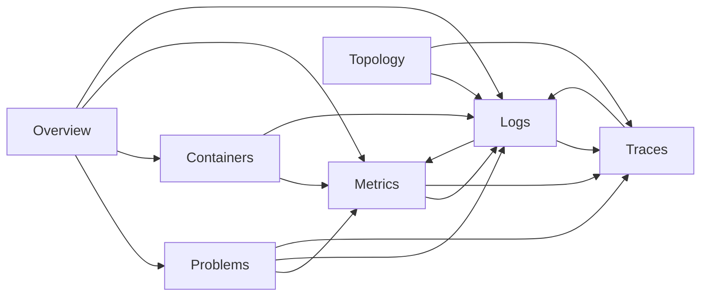
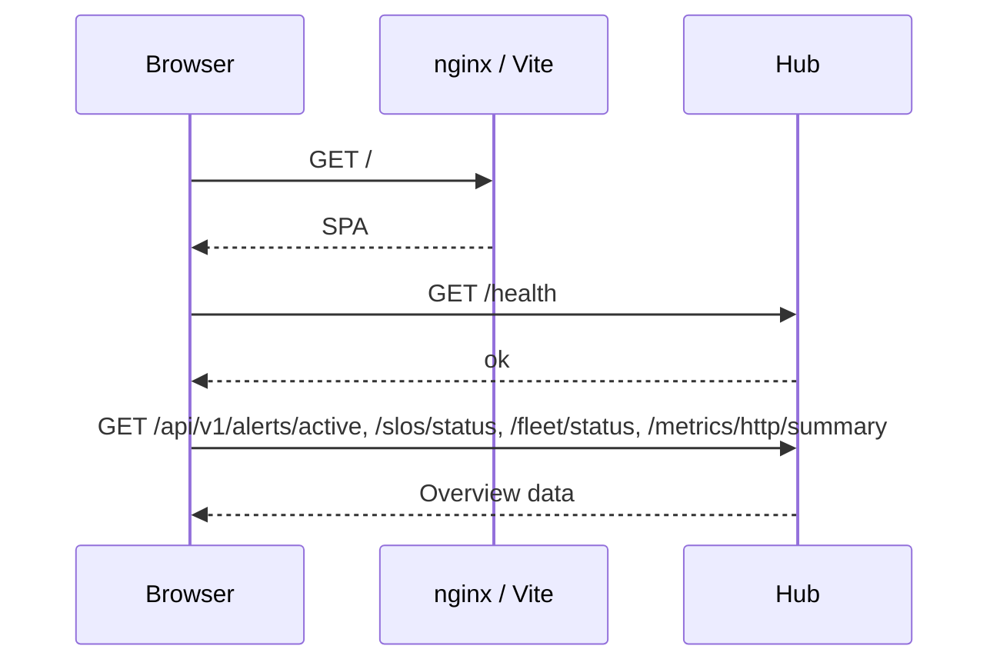
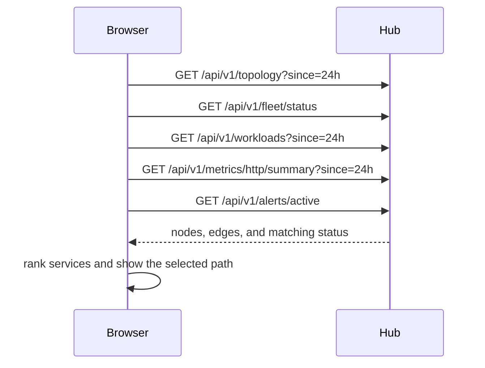
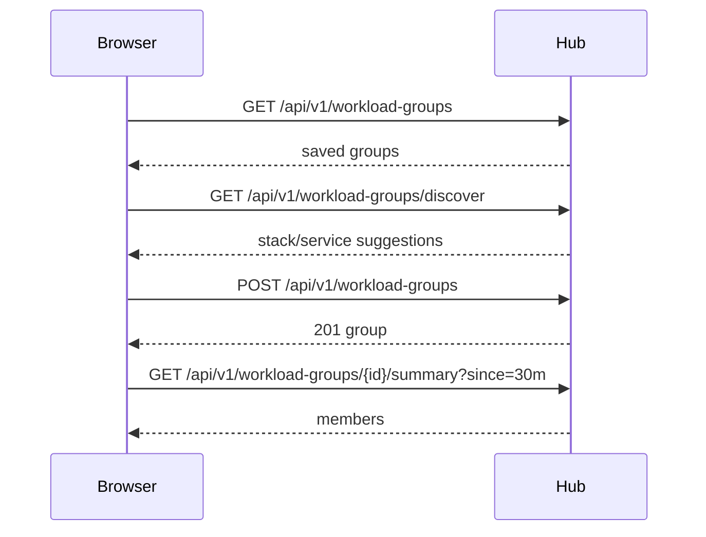

# Flow: management panel

React SPA (`web/`) consuming the hub API. shadcn/ui components.

## Information architecture

Seven destinations in the menu (`web/src/lib/navigation.ts`). Filters, groupings, and pivots are modes inside a screen, not destinations of their own.

| Destination | Route | What it shows | Modes (parameter) |
|---|---|---|---|
| Overview | `/` | Only what needs action: active alerts, SLOs breached or with low budget, containers with issues, HTTP services over 1% error | — |
| Problems | `/problems` | Active alerts and insights, SLOs, event history | `tab=now` (default), `tab=slos`, `tab=history` |
| Containers | `/containers` | Resource (CPU, memory) and state (health, restarts, OOM) of each container | `view=grid` (default) or `view=table`, `filter=unstable`, `panel=groups` |
| Metrics | `/metrics` | Series of one container or comparison across containers | `mode=container` (default) or `mode=compare` |
| Logs | `/logs` | Line search and repeated patterns with the same filters | `mode=lines` (default) or `mode=patterns` |
| Traces | `/traces` | Recent traces by service and range; waterfall of the open trace | `trace_id` opens the detail |
| Topology | `/topology` | Service dependencies, observed from the kernel when available and inferred from logs otherwise | — |

The screen has a single title (`PageHeader`), the same as the menu name. The top bar only has the menu button. The first focusable element is the "Skip to content" link (`#main`), and the menu sits in a `nav` landmark with `aria-label` from the locale.

## State in the URL

Everything that changes what is on screen lives in the query string and survives reload or a shared link (`web/src/hooks/use-query-state.ts`). Values equal to the default are stripped from the URL.

| Parameter | Screens | Values |
|---|---|---|
| `since` | Metrics, Logs, Problems, Traces, Topology | `15m`, `1h`, `6h`, `24h` |
| `group` | Containers, Metrics, Logs, Problems (Now) | `workload-groups` id |
| `container` | Metrics, Logs | container name |
| `service` | Metrics, Traces | service name; in Metrics it selects the service's containers |
| `metric`, `containers`, `chart`, `stat` | Metrics (compare) | catalog metric, comma-separated list, `area`/`line`, `avg`/`max` |
| `q`, `level`, `topic`, `trace_id` | Logs | text, level, topic, trace |

## Legacy routes

They redirect to the equivalent mode and keep the received parameters (`web/src/components/layout/redirect.tsx`).

| Before | After |
|---|---|
| `/workloads` | `/containers` |
| `/fleet` | `/containers?view=table` |
| `/groups` | `/containers?panel=groups` |
| `/explorer` | `/metrics?mode=compare` |
| `/patterns` | `/logs?mode=patterns` |
| `/insights` | `/problems` |
| `/slos` | `/problems?tab=slos` |
| `/events` | `/problems?tab=history` |

## Navigation map

```mermaid
flowchart LR
  Overview[Overview] --> Problems[Problems]
  Overview --> Containers
  Overview --> Metrics[Metrics]
  Overview --> Logs
  Problems --> Metrics
  Problems --> Logs
  Problems --> Traces
  Containers --> Metrics
  Containers --> Logs
  Metrics --> Logs
  Metrics --> Traces
  Logs --> Traces
  Logs --> Metrics
  Traces --> Logs
  Topology[Topology] --> Logs
  Topology --> Traces
```

Every screen leads to at least one other with the filter applied.

## Sequence — load

```mermaid
sequenceDiagram
  participant Browser
  participant Web as nginx / Vite
  participant Hub

  Browser->>Web: GET /
  Web-->>Browser: SPA
  Browser->>Hub: GET /health
  Hub-->>Browser: ok
  Browser->>Hub: GET /api/v1/alerts/active, /slos/status, /fleet/status, /metrics/http/summary
  Hub-->>Browser: Overview data
```

Overview, Problems, Containers, and Logs (patterns) refresh every 30 s; Logs (lines) every 15 s.

## Sequence — topology

The screen loads topology plus the fleet, workload, HTTP summary, and active alerts that already exist. `focus` in the URL selects a service. A later incident can set that same parameter. The path is only the callers and dependencies of the selection (`web/src/pages/topology.tsx`).

```mermaid
sequenceDiagram
  participant Browser
  participant Hub

  Browser->>Hub: GET /api/v1/topology?since=24h
  Browser->>Hub: GET /api/v1/fleet/status
  Browser->>Hub: GET /api/v1/workloads?since=24h
  Browser->>Hub: GET /api/v1/metrics/http/summary?since=24h
  Browser->>Hub: GET /api/v1/alerts/active
  Hub-->>Browser: nodes, edges, and matching status
  Browser->>Browser: rank services and show the selected path
```

## Sequence — groups

The group list loads with Containers. The panel (`panel=groups`) asks for suggestions and writes with POST. A selected group (`group`) filters the grid by the summary (`web/src/pages/containers.tsx`, `web/src/views/groups-panel.tsx`).

```mermaid
sequenceDiagram
  participant Browser
  participant Hub

  Browser->>Hub: GET /api/v1/workload-groups
  Hub-->>Browser: saved groups
  Browser->>Hub: GET /api/v1/workload-groups/discover
  Hub-->>Browser: stack/service suggestions
  Browser->>Hub: POST /api/v1/workload-groups
  Hub-->>Browser: 201 group
  Browser->>Hub: GET /api/v1/workload-groups/{id}/summary?since=30m
  Hub-->>Browser: members
```

Deleting a group is `DELETE /api/v1/workload-groups/{id}` (`204`).

## Dev

Vite proxy: `/api` and `/health` → hub (`web/vite.config.ts`).

Production build: `npm run build` — artifacts served by the `argus-web` container.

## References

- Layout: `web/src/components/layout/`
- Screens: `web/src/pages/`; pieces reused by screens: `web/src/views/`
- Filters: `web/src/components/filters/`
- Metrics UI: `web/src/components/metrics/`
- Product map: [../map.md](../map.md)
