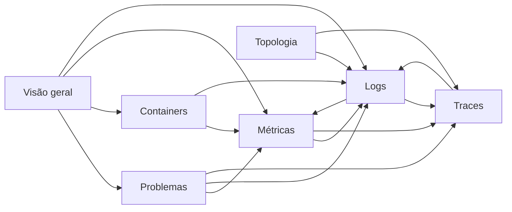
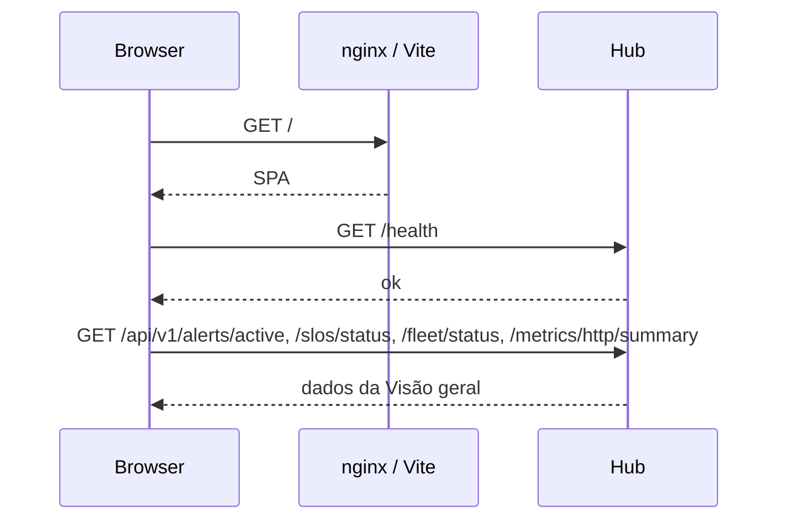
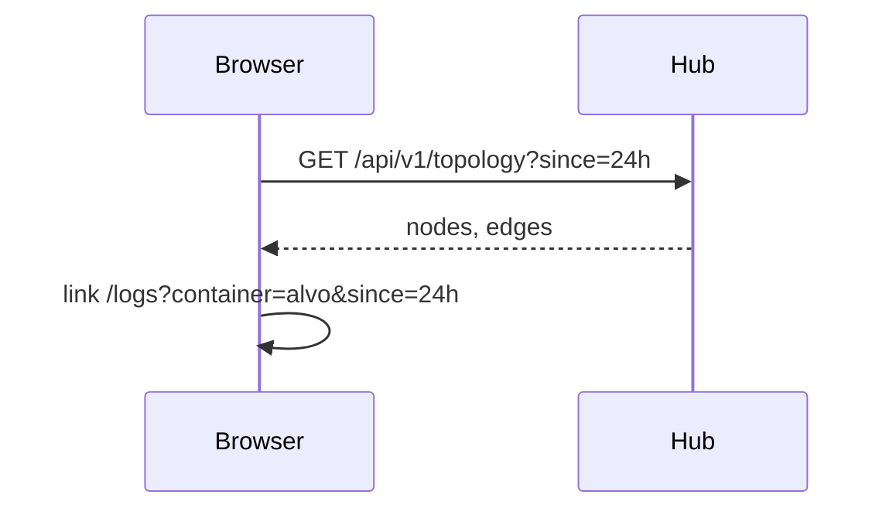
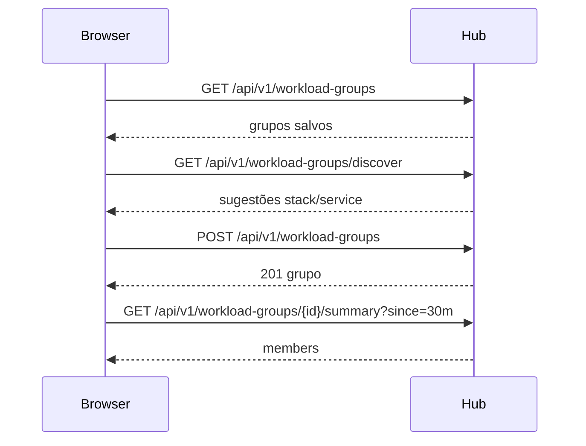

# Fluxo: painel de gestão

SPA React (`web/`) consumindo a API do hub. Componentes shadcn/ui.

## Arquitetura de informação

Sete destinos no menu (`web/src/lib/navigation.ts`). Filtros, agrupamentos e pivôs são modos dentro da tela, não destinos próprios.

| Destino | Rota | O que mostra | Modos (parâmetro) |
|---|---|---|---|
| Visão geral | `/` | Só o que pede ação: alertas ativos, SLOs violados ou com margem baixa, containers com problema, serviços HTTP acima de 1% de erro | — |
| Problemas | `/problems` | Alertas ativos e insights, SLOs, histórico de eventos | `tab=now` (padrão), `tab=slos`, `tab=history` |
| Containers | `/containers` | Recurso (CPU, memória) e estado (health, reinícios, OOM) de cada container | `view=grid` (padrão) ou `view=table`, `filter=unstable`, `panel=groups` |
| Métricas | `/metrics` | Séries de um container ou comparação entre containers | `mode=container` (padrão) ou `mode=compare` |
| Logs | `/logs` | Busca de linhas e padrões repetidos com os mesmos filtros | `mode=lines` (padrão) ou `mode=patterns` |
| Traces | `/traces` | Traces recentes por serviço e período; waterfall do trace aberto | `trace_id` abre o detalhe |
| Topologia | `/topology` | Dependências entre serviços inferidas dos logs | — |

A tela tem um único título (`PageHeader`), igual ao nome no menu. A barra do topo só tem o botão do menu. O primeiro elemento focável é o link "Pular para o conteúdo" (`#conteudo`), e o menu fica num landmark `nav` com `aria-label="Principal"`.

## Estado na URL

Tudo o que muda o que está na tela fica na query string e sobrevive a recarregar ou compartilhar o link (`web/src/hooks/use-query-state.ts`). Valores iguais ao padrão são removidos da URL.

| Parâmetro | Telas | Valores |
|---|---|---|
| `since` | Métricas, Logs, Problemas, Traces, Topologia | `15m`, `1h`, `6h`, `24h` |
| `group` | Containers, Métricas, Logs, Problemas (Agora) | id de `workload-groups` |
| `container` | Métricas, Logs | nome do container |
| `service` | Métricas, Traces | nome do serviço; em Métricas escolhe os containers do serviço |
| `metric`, `containers`, `chart`, `stat` | Métricas (comparar) | métrica do catálogo, lista separada por vírgula, `area`/`line`, `avg`/`max` |
| `q`, `level`, `topic`, `trace_id` | Logs | texto, nível, tópico, trace |

## Rotas antigas

Redirecionam para o modo equivalente e mantêm os parâmetros recebidos (`web/src/components/layout/redirect.tsx`).

| Antes | Depois |
|---|---|
| `/workloads` | `/containers` |
| `/fleet` | `/containers?view=table` |
| `/groups` | `/containers?panel=groups` |
| `/explorer` | `/metrics?mode=compare` |
| `/patterns` | `/logs?mode=patterns` |
| `/insights` | `/problems` |
| `/slos` | `/problems?tab=slos` |
| `/events` | `/problems?tab=history` |

## Mapa de navegação

```mermaid
flowchart LR
  Overview[Visão geral] --> Problems[Problemas]
  Overview --> Containers
  Overview --> Metrics[Métricas]
  Overview --> Logs
  Problems --> Metrics
  Problems --> Logs
  Problems --> Traces
  Containers --> Metrics
  Containers --> Logs
  Metrics --> Logs
  Metrics --> Traces
  Logs --> Traces
  Logs --> Metrics
  Traces --> Logs
  Topology[Topologia] --> Logs
  Topology --> Traces
```

Toda tela leva a pelo menos uma outra com o filtro aplicado.

## Sequência — carregamento

```mermaid
sequenceDiagram
  participant Browser
  participant Web as nginx / Vite
  participant Hub

  Browser->>Web: GET /
  Web-->>Browser: SPA
  Browser->>Hub: GET /health
  Hub-->>Browser: ok
  Browser->>Hub: GET /api/v1/alerts/active, /slos/status, /fleet/status, /metrics/http/summary
  Hub-->>Browser: dados da Visão geral
```

Visão geral, Problemas, Containers e Logs (padrões) atualizam a cada 30 s; Logs (linhas) a cada 15 s.

## Sequência — topologia

A tela chama uma rota. `since` da URL (default `24h`) vai na query. Nó e aresta abrem Logs com o mesmo período (`web/src/pages/topology.tsx`).

```mermaid
sequenceDiagram
  participant Browser
  participant Hub

  Browser->>Hub: GET /api/v1/topology?since=24h
  Hub-->>Browser: nodes, edges
  Browser->>Browser: link /logs?container=alvo&since=24h
```

## Sequência — grupos

A lista de grupos carrega com Containers. O painel (`panel=groups`) pede sugestões e grava com POST. Um grupo selecionado (`group`) filtra a grade pelo summary (`web/src/pages/containers.tsx`, `web/src/views/groups-panel.tsx`).

```mermaid
sequenceDiagram
  participant Browser
  participant Hub

  Browser->>Hub: GET /api/v1/workload-groups
  Hub-->>Browser: grupos salvos
  Browser->>Hub: GET /api/v1/workload-groups/discover
  Hub-->>Browser: sugestões stack/service
  Browser->>Hub: POST /api/v1/workload-groups
  Hub-->>Browser: 201 grupo
  Browser->>Hub: GET /api/v1/workload-groups/{id}/summary?since=30m
  Hub-->>Browser: members
```

Apagar um grupo é `DELETE /api/v1/workload-groups/{id}` (`204`).

## Dev

Proxy Vite: `/api` e `/health` → hub (`web/vite.config.ts`).

Build produção: `npm run build` — artefatos servidos pelo container `argus-web`.

## Referências

- Layout: `web/src/components/layout/`
- Telas: `web/src/pages/`; partes reutilizadas pelas telas: `web/src/views/`
- Filtros: `web/src/components/filters/`
- Métricas UI: `web/src/components/metrics/`
- Mapa produto: [../map.md](../map.md)
