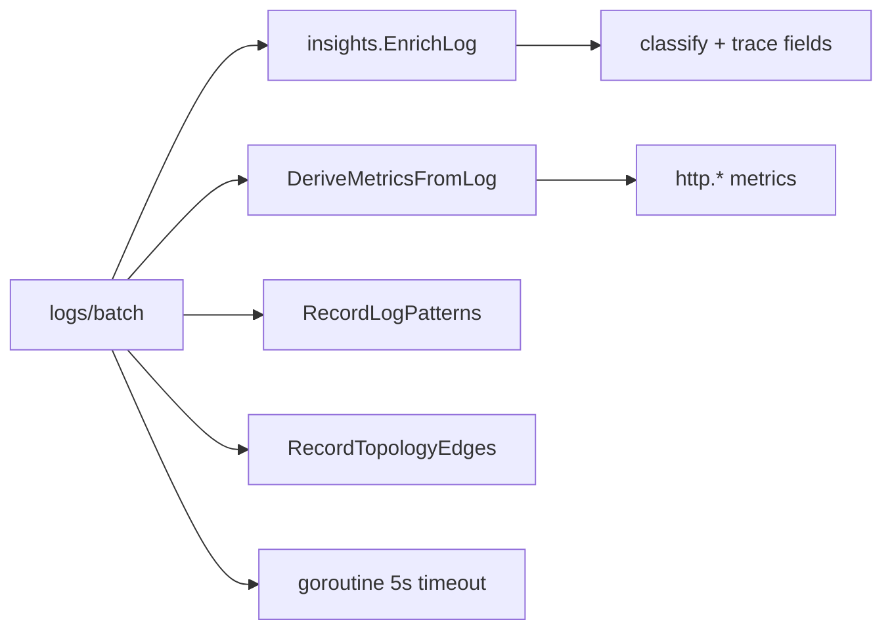

# Mapa do produto Argus

Índice canônico: **funcionalidade → API → código → UI → documentação**.  
Use ao implementar, documentar ou abrir issues do épico [#13](https://github.com/HarryRaddatz/argus-observability/issues/13).

Legenda doc: **ok** = existe · **stub** = esboço · **gap** = falta escrever · **fix** = precisa desacoplar conteúdo interno

## Pilares

| Pilar | Descrição | Issue doc |
|---|---|---|
| Ingest | Agent → hub (métricas, logs, fleet, eventos) | [#17](https://github.com/HarryRaddatz/argus-observability/issues/17) |
| Store | SQLite plugável, retenção, purge | `flows/metrics-ingestion.md` |
| Query | Séries, logs, insights | [#17](https://github.com/HarryRaddatz/argus-observability/issues/17) |
| Observabilidade derivada | HTTP metrics, patterns, topology, traces, SLOs | [#17](https://github.com/HarryRaddatz/argus-observability/issues/17) |
| UI | Painel shadcn em `web/` | `flows/ui-panel.md` (ok) |
| Regras | CPU/mem, SLO budget | `flows/events-and-alerts.md` (ok) |

## Agent ↔ Hub

| Fluxo | Método | Rota | Handler | Doc |
|---|---|---|---|---|
| Registro | POST | `/api/v1/agents/register` | `internal/hub/server.go` | `flows/agent-connection.md` ok |
| Heartbeat | POST | `/api/v1/agents/heartbeat` | `internal/hub/server.go` | ok |
| Métricas | POST | `/api/v1/metrics/batch` | `handleMetricsBatch` | `flows/metrics-ingestion.md` ok |
| Logs | POST | `/api/v1/logs/batch` | `handleLogsBatch` | `flows/log-streaming.md` ok |
| Fleet | POST | `/api/v1/fleet/batch` | `internal/hub/fleet.go` | gap |
| Eventos | POST | `/api/v1/events` | `handleEventIngest` | `flows/events-and-alerts.md` ok |

Coleta: `internal/agent/docker/` · envio: `internal/agent/client.go`

## Consulta e painel

| Funcionalidade | API | Handler | Store / lógica | UI | Doc |
|---|---|---|---|---|---|
| Health | GET `/health` | `server.go` | — | — | gap |
| Workloads | GET `/api/v1/workloads` | `server.go` | `ListWorkloads` | `/workloads` | gap |
| Métricas (série) | GET `/api/v1/metrics/series` | `server.go` | `QueryMetricSeries` | `/metrics`, `/explorer` | ok |
| Catálogo métricas | GET `/api/v1/metrics/catalog` | `server.go` | estático | `/explorer` | gap |
| HTTP summary | GET `/api/v1/metrics/http/summary` | `server.go` | `http_summary.go` | `/dashboard` | gap |
| Query genérica | GET `/api/v1/query` | `server.go` | `QueryMetrics` | — | gap |
| Logs search | GET `/api/v1/logs/search` | `server.go` | `SearchLogs` + `trace_query.go` | `/logs` | ok |
| Log patterns | GET `/api/v1/logs/patterns` | `patterns.go` | `patterns.go` | `/patterns` | gap |
| Eventos | GET `/api/v1/events` | `server.go` | `ListEvents` | `/events` | ok |
| Alertas ativos | GET `/api/v1/alerts/active` | `topology.go` | `rules/engine.go` | `/events` | gap |
| Insights | GET `/api/v1/insights` | `server.go` | `internal/insights/*` | `/insights` | gap |
| Fleet status | GET `/api/v1/fleet/status` | `fleet.go` | `fleet.go` | `/fleet` | gap |
| Grupos CRUD | `/api/v1/workload-groups*` | `groups.go` | `groups.go` | `/groups` | gap |
| Topologia | GET `/api/v1/topology` | `topology.go` | `topology_edges` | `/topology` | gap |
| Traces (OTLP) | POST `/v1/traces` | `otlp.go` | `trace_spans` | — | gap |
| Trace detail | GET `/api/v1/traces/{id}` | `traces.go` | `traces.go` + `traces/from_logs.go` | `/traces` | gap |
| SLOs | GET `/api/v1/slos`, `/status` | `slos.go` | `traces.go` (slos table) | `/slos` | gap |

## Pipeline de enriquecimento (logs → derivados)

| Etapa | Pacote | Disparo |
|---|---|---|
| Classificação / traceId | `internal/insights/classify.go`, `parse_traces.go` | ingest logs |
| Métricas HTTP | `internal/insights/derive_metrics.go` | ingest logs |
| Patterns | `internal/insights/normalize.go` | ingest async |
| Topologia | `internal/topology/infer.go` | ingest async |
| Insights | `internal/insights/analyze.go`, `group.go`, `patterns.go` | GET insights |
| Rules | `internal/rules/engine.go` | loop 30s |
| SLO | `internal/slo/evaluator.go` | loop 60s |

## Modelo de dados (SQLite)

| Tabela | Pacote | Retenção |
|---|---|---|
| `agents` | `sqlite.go` | — |
| `metric_points` | `sqlite.go` | `ARGUS_RETENTION_METRICS` |
| `log_entries` | `sqlite.go` | `ARGUS_RETENTION_LOGS` |
| `events` | `sqlite.go` | `ARGUS_RETENTION_EVENTS` |
| `container_fleet` | `fleet.go` | snapshot |
| `workload_groups` | `groups.go` | — |
| `log_patterns` | `patterns.go` | com logs |
| `topology_edges` | `patterns.go` | com logs |
| `trace_spans` | `traces.go` | com logs |
| `slos` | `traces.go` | — |

Interface: `internal/store/store.go` · implementação: `internal/store/sqlite/`

## Configuração (env)

| Variável | Componente | Doc target |
|---|---|---|
| `ARGUS_HUB_ADDR` | hub | `docs/api/configuration.md` gap |
| `ARGUS_STORE_PATH` | hub | gap |
| `ARGUS_AGENT_TOKEN` | hub + agent | gap |
| `ARGUS_RETENTION_*` | hub | gap |
| `ARGUS_HUB_URL` | agent | gap |
| `ARGUS_AGENT_ID`, `ARGUS_HOST_ID` | agent | gap · **fix** generic host id |
| `ARGUS_COLLECT_INTERVAL` | agent | gap |

Ver `.env.example` · tarefa [#16](https://github.com/HarryRaddatz/argus-observability/issues/16).

## Binários e deploy

| Artefato | Build | Compose service |
|---|---|---|
| `argus-hub` | `Dockerfile.hub` · `cmd/hub` | `argus-hub` |
| `argus-agent` | `Dockerfile.agent` · `cmd/agent` | `argus-agent` |
| UI estática | `web/Dockerfile` | `argus-web` |

CI: `.github/workflows/ci.yml` · Release (tag → GHCR): `.github/workflows/release.yml`

Imagens: `ghcr.io/harryraddatz/argus-{hub,agent,web}` · Compose publicado: `examples/compose-minimal/docker-compose.published.yml`

Exemplo mínimo: [#19](https://github.com/HarryRaddatz/argus-observability/issues/19) · Pipeline: épico [#24](https://github.com/HarryRaddatz/argus-observability/issues/24)

## Épico #13 — tarefas de biblioteca pública

| # | Tarefa | Issue |
|---|---|---|
| 1 | Docs de entrada | [#14](https://github.com/HarryRaddatz/argus-observability/issues/14) |
| 2 | API reference | [#17](https://github.com/HarryRaddatz/argus-observability/issues/17) |
| 3 | Config genérica | [#16](https://github.com/HarryRaddatz/argus-observability/issues/16) |
| 4 | Licença e releases | [#15](https://github.com/HarryRaddatz/argus-observability/issues/15) |
| 5 | CI | [#18](https://github.com/HarryRaddatz/argus-observability/issues/18) |
| 6 | Examples | [#19](https://github.com/HarryRaddatz/argus-observability/issues/19) |
| 7 | Auditoria anti-vazamento | [#20](https://github.com/HarryRaddatz/argus-observability/issues/20) |
| 8 | IA e layout do painel | [#21](https://github.com/HarryRaddatz/argus-observability/issues/21) |
| 9 | Gráficos de infraestrutura | [#22](https://github.com/HarryRaddatz/argus-observability/issues/22) |

Detalhe: [public-library/roadmap.md](public-library/roadmap.md)
