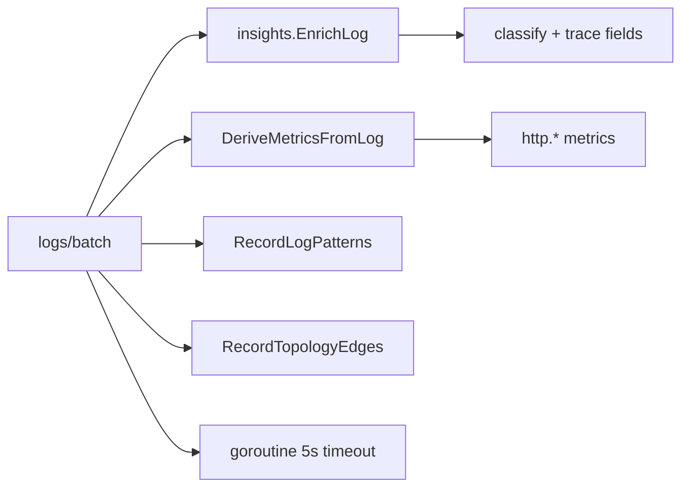
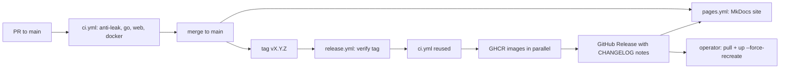

# Argus product map

Canonical index: **feature → API → code → UI → docs**.  
Use this when implementing, documenting, or opening issues on epic [#13](https://github.com/HarryRaddatz/argus-observability/issues/13).

Doc legend: **ok** = exists · **stub** = draft · **gap** = missing · **fix** = needs decoupling from internal content

## Pillars

| Pillar | Description | Doc issue |
|---|---|---|
| Ingest | Agent → hub (metrics, logs, fleet, events) | [#17](https://github.com/HarryRaddatz/argus-observability/issues/17) |
| Store | Pluggable SQLite, retention, purge | `flows/metrics-ingestion.md` |
| Query | Series, logs, insights | [#17](https://github.com/HarryRaddatz/argus-observability/issues/17) |
| Derived observability | HTTP metrics, patterns, topology, traces, SLOs | [#17](https://github.com/HarryRaddatz/argus-observability/issues/17) |
| UI | shadcn panel in `web/` | `flows/ui-panel.md` (ok) |
| Rules | CPU/mem, SLO budget | `flows/events-and-alerts.md` (ok) |

## Agent ↔ Hub

| Flow | Method | Route | Handler | Doc |
|---|---|---|---|---|
| Register | POST | `/api/v1/agents/register` | `internal/hub/server.go` | `flows/agent-connection.md` ok |
| Heartbeat | POST | `/api/v1/agents/heartbeat` | `internal/hub/server.go` | ok |
| Metrics | POST | `/api/v1/metrics/batch` | `handleMetricsBatch` | `flows/metrics-ingestion.md` ok |
| Logs | POST | `/api/v1/logs/batch` | `handleLogsBatch` | `flows/log-streaming.md` ok |
| Fleet | POST | `/api/v1/fleet/batch` | `internal/hub/fleet.go` | [ingest.md](api/ingest.md) ok |
| Events | POST | `/api/v1/events` | `handleEventIngest` | [ingest.md](api/ingest.md) ok |

Collection: `internal/agent/docker/` · send: `internal/agent/client.go`

## Query and panel

| Feature | API | Handler | Store / logic | UI | Doc |
|---|---|---|---|---|---|
| Health | GET `/health` | `server.go` | — | — | [query.md](api/query.md) ok |
| Workloads | GET `/api/v1/workloads` | `server.go` | `ListWorkloads` | `/containers` | [query.md](api/query.md) stub |
| Metrics (series) | GET `/api/v1/metrics/series` | `server.go` | `QueryMetricSeries` | `/metrics` (by container and compare) | [query.md](api/query.md) ok |
| Metric catalog | GET `/api/v1/metrics/catalog` | `server.go` | static | `/metrics?mode=compare` | [query.md](api/query.md) stub |
| HTTP summary | GET `/api/v1/metrics/http/summary` | `server.go` | `http_summary.go` | `/` (Overview) | [query.md](api/query.md) stub |
| Generic query | GET `/api/v1/query` | `server.go` | `QueryMetrics` | — | gap |
| Logs search | GET `/api/v1/logs/search` | `server.go` | `SearchLogs` + `trace_query.go` | `/logs` | [query.md](api/query.md) stub |
| Log patterns | GET `/api/v1/logs/patterns` | `patterns.go` | `patterns.go` | `/logs?mode=patterns` | [observability.md](api/observability.md) stub |
| Events | GET `/api/v1/events` | `server.go` | `ListEvents` | `/problems?tab=history` | [query.md](api/query.md) stub |
| Active alerts | GET `/api/v1/alerts/active` | `topology.go` | `rules/engine.go` | `/problems`, `/` | [observability.md](api/observability.md) ok |
| Insights | GET `/api/v1/insights` | `server.go` | `internal/insights/*` | `/problems` | [observability.md](api/observability.md) ok |
| Fleet status | GET `/api/v1/fleet/status` | `fleet.go` | `fleet.go` | `/containers`, `/` | [query.md](api/query.md) stub |
| Groups CRUD | `/api/v1/workload-groups*` | `groups.go` | `groups.go` | `/containers?panel=groups` | [query.md](api/query.md) stub |
| Topology | GET `/api/v1/topology` | `topology.go` | `topology_edges` | `/topology` | [observability.md](api/observability.md) ok |
| Traces (OTLP) | POST `/v1/traces` | `otlp.go` | `trace_spans` | — | [ingest.md](api/ingest.md) ok |
| Recent traces | GET `/api/v1/traces` | `traces.go` | `ListTraces` (`trace_spans` + `log_entries`) | `/traces` | [observability.md](api/observability.md) ok |
| Trace detail | GET `/api/v1/traces/{id}` | `traces.go` | `traces.go` + `traces/from_logs.go` | `/traces?trace_id=` | [observability.md](api/observability.md) stub |
| SLOs | GET `/api/v1/slos`, `/status` | `slos.go` | `traces.go` (slos table) | `/problems?tab=slos` | [observability.md](api/observability.md) ok |

Still missing from this table ([#17](https://github.com/HarryRaddatz/argus-observability/issues/17)):

| Status | Endpoint | Missing in the doc |
|---|---|---|
| stub | GET `/api/v1/workloads` | Default `since` (`15m`) and optional fields `stack`, `service`, `labels` |
| stub | GET `/api/v1/metrics/catalog` | Array `{name, label, unit}` (static list in `server.go`) |
| stub | GET `/api/v1/metrics/http/summary` | `since` (default `1h`) and `HTTPServiceSummary` array |
| gap | GET `/api/v1/query` | Page does not describe the route. Contract: required `metric` (`400` if empty), default `since` `1h`, body `QuerySeries` (`metric_name`, `points[]` of `{ts, value}`) |
| stub | GET `/api/v1/logs/search` | Filters besides `since`, `container`, and `q`: `level`, `topic`, `trace_id`, `entity_uid`, `group`, `limit` |
| stub | GET `/api/v1/logs/patterns` | Body: array of `LogPattern` (`pattern_key`, `pattern`, `container`, `service`, `count`, `last_seen`, `sample`), up to 50 |
| stub | GET `/api/v1/events` | Body: array of `Event` and the default `since` |
| stub | GET `/api/v1/fleet/status` | Body `FleetStatusResponse` (`updated_at`, `summary`, `services`, `containers`, `events_24h`) |
| stub | `/api/v1/workload-groups*` | Bodies of `WorkloadGroup`, `WorkloadGroupInput`, and `WorkloadGroupSummary`; codes `201`, `204`, `400`, `404` |
| stub | GET `/api/v1/traces/{id}` | Body `TraceDetail` (`trace_id`, `source`, `start_ts`, `end_ts`, `duration_ms`, `spans[]`) and `since` only on the logs fallback (default `24h`) |

## Enrichment pipeline (logs → derived)

```mermaid
flowchart LR
  Logs[logs/batch] --> Enrich[insights.EnrichLog]
  Enrich --> Topics[classify + trace fields]
  Logs --> Derive[DeriveMetricsFromLog]
  Derive --> HTTPM[http.* metrics]
  Logs --> Patterns[RecordLogPatterns]
  Logs --> Topo[RecordTopologyEdges]
  Logs --> Async[goroutine 5s timeout]
```

| Step | Package | Trigger |
|---|---|---|
| Classification / traceId | `internal/insights/classify.go`, `parse_traces.go` | logs ingest |
| HTTP metrics | `internal/insights/derive_metrics.go` | logs ingest |
| Patterns | `internal/insights/normalize.go` | ingest async |
| Topology | `internal/topology/infer.go` | ingest async |
| Insights | `internal/insights/analyze.go`, `group.go`, `patterns.go` | GET insights |
| Rules | `internal/rules/engine.go` | loop 30s |
| SLO | `internal/slo/evaluator.go` | loop 60s |

## Data model (SQLite)

| Table | Package | Retention |
|---|---|---|
| `agents` | `sqlite.go` | — |
| `metric_points` | `sqlite.go` | `ARGUS_RETENTION_METRICS` |
| `log_entries` | `sqlite.go` | `ARGUS_RETENTION_LOGS` |
| `events` | `sqlite.go` | `ARGUS_RETENTION_EVENTS` |
| `container_fleet` | `fleet.go` | snapshot |
| `workload_groups` | `groups.go` | — |
| `log_patterns` | `patterns.go` | with logs |
| `topology_edges` | `patterns.go` | with logs |
| `trace_spans` | `traces.go` | with logs |
| `slos` | `traces.go` | — |

Interface: `internal/store/store.go` · implementation: `internal/store/sqlite/`

## Configuration (env)

| Variable | Component | Doc |
|---|---|---|
| `ARGUS_HUB_ADDR` | hub | [configuration.md](api/configuration.md) ok |
| `ARGUS_STORE_PATH` | hub | ok |
| `ARGUS_AGENT_TOKEN` | hub + agent | ok |
| `ARGUS_RETENTION_LOGS`, `ARGUS_RETENTION_METRICS`, `ARGUS_RETENTION_EVENTS` | hub | ok |
| `ARGUS_PURGE_INTERVAL`, `ARGUS_PURGE_TIMEOUT` | hub | ok |
| `ARGUS_HUB_URL` | agent | ok |
| `ARGUS_AGENT_ID`, `ARGUS_HOST_ID` | agent | ok · generic host id (operator label, not an inventory) |
| `ARGUS_COLLECT_INTERVAL` | agent | ok |

Not in `.env.example`, but read by the binary and described on the same page: `ARGUS_LOG_INTERVAL`, `ARGUS_FLEET_INTERVAL`, `ARGUS_NAME_PREFIX`, `DOCKER_HOST`, `VITE_API_BASE`, `VITE_HUB_PROXY`.

See `.env.example` · task [#16](https://github.com/HarryRaddatz/argus-observability/issues/16).

## Binaries and deploy

| Artifact | Build | Compose service |
|---|---|---|
| `argus-hub` | `Dockerfile.hub` · `cmd/hub` | `argus-hub` |
| `argus-agent` | `Dockerfile.agent` · `cmd/agent` | `argus-agent` |
| Static UI | `web/Dockerfile` | `argus-web` |

CI: `.github/workflows/ci.yml` · Release (tag → GHCR): `.github/workflows/release.yml`

Images (`linux/amd64`, `linux/arm64`): `ghcr.io/harryraddatz/argus-{hub,agent,web}` and `docker.io/pseudohuery/argus-{hub,agent,web}` · Docker Hub README: `.github/dockerhub/` · Published compose: `examples/compose-minimal/docker-compose.published.yml` (`ARGUS_REGISTRY`)

```mermaid
flowchart LR
  PR[PR to main] --> CI[ci.yml: anti-leak, go, web, docker]
  CI --> Main[merge to main]
  Main --> Pages[pages.yml: MkDocs site]
  Main --> Tag[tag vX.Y.Z]
  Tag --> Verify[release.yml: verify tag]
  Verify --> RelCI[ci.yml reused]
  RelCI --> Img[GHCR images in parallel]
  Img --> GHR[GitHub Release with CHANGELOG notes]
  GHR --> Pages
  GHR --> Deploy[operator: pull + up --force-recreate]
```

| Step | File | Doc |
|---|---|---|
| PR checks | `.github/workflows/ci.yml` | `CONTRIBUTING.md` (CI and branch protection) |
| Versioning | `CHANGELOG.md` · `.github/scripts/changelog-extract.sh` | `CONTRIBUTING.md` (Release) |
| Publishing | `.github/workflows/release.yml` | `CONTRIBUTING.md` (Release) |
| Documentation site | `.github/workflows/pages.yml` · `mkdocs.yml` · `.github/pages/` | `CONTRIBUTING.md` (Documentation site) |
| Instance upgrade | `examples/compose-minimal/docker-compose.published.yml` | `docs/deploy.md` |

Minimal example: [#19](https://github.com/HarryRaddatz/argus-observability/issues/19) · Pipeline: epic [#24](https://github.com/HarryRaddatz/argus-observability/issues/24)

## Epic #13 — public library tasks

| # | Task | Issue |
|---|---|---|
| 1 | Entry docs | [#14](https://github.com/HarryRaddatz/argus-observability/issues/14) |
| 2 | API reference | [#17](https://github.com/HarryRaddatz/argus-observability/issues/17) |
| 3 | Generic config | [#16](https://github.com/HarryRaddatz/argus-observability/issues/16) |
| 4 | License and releases | [#15](https://github.com/HarryRaddatz/argus-observability/issues/15) |
| 5 | CI | [#18](https://github.com/HarryRaddatz/argus-observability/issues/18) |
| 6 | Examples | [#19](https://github.com/HarryRaddatz/argus-observability/issues/19) |
| 7 | Anti-leak audit | [#20](https://github.com/HarryRaddatz/argus-observability/issues/20) |
| 8 | Panel IA and layout | [#21](https://github.com/HarryRaddatz/argus-observability/issues/21) |
| 9 | Infrastructure charts | [#22](https://github.com/HarryRaddatz/argus-observability/issues/22) |

Detail: [public-library/roadmap.md](public-library/roadmap.md)
