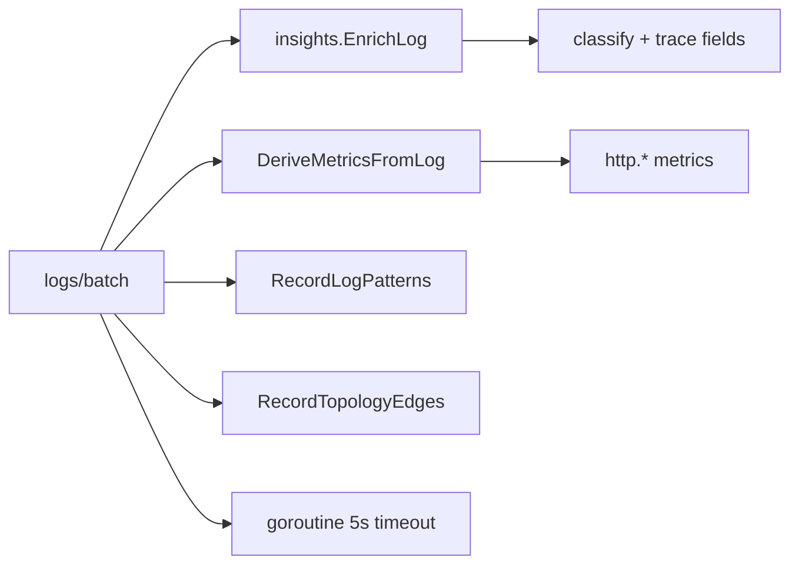
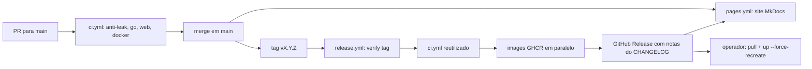

# Mapa do produto Argus

Índice canônico: **funcionalidade → API → código → UI → documentação**.  
Use ao implementar, documentar ou abrir issues do épico [#13](https://github.com/HarryRaddatz/argus-observability/issues/13).

Legenda doc: **ok** = existe · **stub** = esboço · **gap** = falta escrever · **fix** = precisa desacoplar conteúdo interno

## Pilares

| Pilar | Descrição | Issue doc |
|---|---|---|
| Ingest | Agent → hub (métricas, logs, fleet, eventos) | [#17](https://github.com/HarryRaddatz/argus-observability/issues/17) |
| Store | Driver plugável, Postgres no default, retenção, purge | `flows/metrics-ingestion.md` |
| Query | Séries, logs, insights | [#17](https://github.com/HarryRaddatz/argus-observability/issues/17) |
| Observabilidade derivada | HTTP metrics, patterns, topology, traces, SLOs | [#17](https://github.com/HarryRaddatz/argus-observability/issues/17) |
| UI | Painel shadcn em `web/` | `flows/ui-panel.md` (ok) |
| Regras | CPU/mem, SLO budget | `flows/events-and-alerts.md` (ok) |

## Agent ↔ Hub

| Fluxo | Método | Rota | Handler | Doc |
|---|---|---|---|---|
| Registro | POST | `/api/v1/agents/register` | `internal/hub/server.go` | `flows/agent-connection.md` ok |
| Heartbeat | POST | `/api/v1/agents/heartbeat` | `internal/hub/server.go` | ok |
| Métricas | POST | `/api/v1/metrics/batch` | `handleMetricsBatch` | `flows/metrics-ingestion.md` ok |
| Logs | POST | `/api/v1/logs/batch` | `handleLogsBatch` | `flows/log-streaming.md` ok |
| Fleet | POST | `/api/v1/fleet/batch` | `internal/hub/fleet.go` | [ingest.md](api/ingest.md) ok |
| Eventos | POST | `/api/v1/events` | `handleEventIngest` | [ingest.md](api/ingest.md) ok |

Coleta: `internal/agent/docker/` · envio: `internal/agent/client.go`

## Consulta e painel

| Funcionalidade | API | Handler | Store / lógica | UI | Doc |
|---|---|---|---|---|---|
| Health | GET `/health` | `server.go` | — | — | [query.md](api/query.md) ok |
| Workloads | GET `/api/v1/workloads` | `server.go` | `ListWorkloads` | `/containers` | [query.md](api/query.md) stub |
| Métricas (série) | GET `/api/v1/metrics/series` | `server.go` | `QueryMetricSeries` | `/metrics` (por container e comparar) | [query.md](api/query.md) ok |
| Catálogo métricas | GET `/api/v1/metrics/catalog` | `server.go` | estático | `/metrics?mode=compare` | [query.md](api/query.md) stub |
| HTTP summary | GET `/api/v1/metrics/http/summary` | `server.go` | `http_summary.go` | `/` (Visão geral) | [query.md](api/query.md) stub |
| Query genérica | GET `/api/v1/query` | `server.go` | `QueryMetrics` | — | gap |
| Logs search | GET `/api/v1/logs/search` | `server.go` | `SearchLogs` + `trace_query.go` | `/logs` | [query.md](api/query.md) stub |
| Log patterns | GET `/api/v1/logs/patterns` | `patterns.go` | `patterns.go` | `/logs?mode=patterns` | [observability.md](api/observability.md) stub |
| Eventos | GET `/api/v1/events` | `server.go` | `ListEvents` | `/problems?tab=history` | [query.md](api/query.md) stub |
| Alertas ativos | GET `/api/v1/alerts/active` | `topology.go` | `rules/engine.go` | `/problems`, `/` | [observability.md](api/observability.md) ok |
| Insights | GET `/api/v1/insights` | `server.go` | `internal/insights/*` | `/problems` | [observability.md](api/observability.md) ok |
| Fleet status | GET `/api/v1/fleet/status` | `fleet.go` | `fleet.go` | `/containers`, `/` | [query.md](api/query.md) stub |
| Grupos CRUD | `/api/v1/workload-groups*` | `groups.go` | `groups.go` | `/containers?panel=groups` | [query.md](api/query.md) stub |
| Topologia | GET `/api/v1/topology` | `topology.go` | `topology_edges` | `/topology` | [observability.md](api/observability.md) ok |
| Traces (OTLP) | POST `/v1/traces` | `otlp.go` | `trace_spans` | — | [ingest.md](api/ingest.md) ok |
| Traces recentes | GET `/api/v1/traces` | `traces.go` | `ListTraces` (`trace_spans` + `log_entries`) | `/traces` | [observability.md](api/observability.md) ok |
| Trace detail | GET `/api/v1/traces/{id}` | `traces.go` | `traces.go` + `traces/from_logs.go` | `/traces?trace_id=` | [observability.md](api/observability.md) stub |
| SLOs | GET `/api/v1/slos`, `/status` | `slos.go` | `traces.go` (slos table) | `/problems?tab=slos` | [observability.md](api/observability.md) ok |

O que ainda falta nesta tabela ([#17](https://github.com/HarryRaddatz/argus-observability/issues/17)):

| Status | Endpoint | Falta na doc |
|---|---|---|
| stub | GET `/api/v1/workloads` | Default de `since` (`15m`) e campos opcionais `stack`, `service`, `labels` |
| stub | GET `/api/v1/metrics/catalog` | Array `{name, label, unit}` (lista estática em `server.go`) |
| stub | GET `/api/v1/metrics/http/summary` | `since` (default `1h`) e array `HTTPServiceSummary` |
| gap | GET `/api/v1/query` | Página não descreve a rota. Contrato: `metric` obrigatório (`400` se vazio), `since` default `1h`, corpo `QuerySeries` (`metric_name`, `points[]` de `{ts, value}`) |
| stub | GET `/api/v1/logs/search` | Filtros além de `since`, `container` e `q`: `level`, `topic`, `trace_id`, `entity_uid`, `group`, `limit` |
| stub | GET `/api/v1/logs/patterns` | Corpo: array de `LogPattern` (`pattern_key`, `pattern`, `container`, `service`, `count`, `last_seen`, `sample`), até 50 |
| stub | GET `/api/v1/events` | Corpo: array de `Event` e o default de `since` |
| stub | GET `/api/v1/fleet/status` | Corpo `FleetStatusResponse` (`updated_at`, `summary`, `services`, `containers`, `events_24h`) |
| stub | `/api/v1/workload-groups*` | Corpos de `WorkloadGroup`, `WorkloadGroupInput` e `WorkloadGroupSummary`; códigos `201`, `204`, `400`, `404` |
| stub | GET `/api/v1/traces/{id}` | Corpo `TraceDetail` (`trace_id`, `source`, `start_ts`, `end_ts`, `duration_ms`, `spans[]`) e `since` só no fallback por logs (default `24h`) |

## Pipeline de enriquecimento (logs → derivados)

| Etapa | Pacote | Disparo |
|---|---|---|
| Classificação / traceId | `internal/insights/classify.go`, `parse_traces.go` | ingest logs |
| Métricas HTTP | `internal/insights/derive_metrics.go` | ingest logs |
| Patterns | `internal/insights/normalize.go` | ingest async |
| Topologia | `internal/topology/infer.go` | ingest async |
| Insights | `internal/insights/analyze.go`, `group.go`, `patterns.go` | GET insights |
| Rules | `internal/rules/engine.go` | loop 30s |
| SLO | `internal/slo/evaluator.go` | loop 60s |

## Modelo de dados (Postgres)

| Tabela | Pacote | Retenção |
|---|---|---|
| `agents` | `postgres/db.go` | — |
| `metric_points` | `postgres/db.go` | `ARGUS_RETENTION_METRICS` |
| `log_entries` | `postgres/db.go` | `ARGUS_RETENTION_LOGS` |
| `events` | `postgres/db.go` | `ARGUS_RETENTION_EVENTS` |
| `container_fleet` | `fleet.go` | snapshot |
| `workload_groups` | `groups.go` | — |
| `log_patterns` | `patterns.go` | com logs |
| `topology_edges` | `patterns.go` | com logs |
| `trace_spans` | `traces.go` | com logs |
| `slos` | `traces.go` | — |

Interface: `internal/store/store.go` · seleção de driver: `internal/store/factory` · Postgres: `internal/store/postgres/`

## Configuração (env)

| Variável | Componente | Doc |
|---|---|---|
| `ARGUS_HUB_ADDR` | hub | [configuration.md](api/configuration.md) ok |
| `ARGUS_STORE_DRIVER`, `ARGUS_STORE_DSN` | hub | ok |
| `ARGUS_AGENT_TOKEN` | hub + agent | ok |
| `ARGUS_RETENTION_LOGS`, `ARGUS_RETENTION_METRICS`, `ARGUS_RETENTION_EVENTS` | hub | ok |
| `ARGUS_PURGE_INTERVAL`, `ARGUS_PURGE_TIMEOUT` | hub | ok |
| `ARGUS_HUB_URL` | agent | ok |
| `ARGUS_AGENT_ID`, `ARGUS_HOST_ID` | agent | ok · host id genérico (rótulo do operador, não um inventário) |
| `ARGUS_COLLECT_INTERVAL` | agent | ok |

Fora do `.env.example`, mas lidas pelo binário e descritas na mesma página: `ARGUS_LOG_INTERVAL`, `ARGUS_FLEET_INTERVAL`, `ARGUS_NAME_PREFIX`, `DOCKER_HOST`, `VITE_API_BASE`, `VITE_HUB_PROXY`.

Ver `.env.example` · tarefa [#16](https://github.com/HarryRaddatz/argus-observability/issues/16).

## Binários e deploy

| Artefato | Build | Compose service |
|---|---|---|
| `argus-hub` | `Dockerfile.hub` · `cmd/hub` | `argus-hub` |
| `argus-agent` | `Dockerfile.agent` · `cmd/agent` | `argus-agent` |
| UI estática | `web/Dockerfile` | `argus-web` |

CI: `.github/workflows/ci.yml` · Release (tag → GHCR): `.github/workflows/release.yml`

Imagens (`linux/amd64`, `linux/arm64`): `ghcr.io/harryraddatz/argus-{hub,agent,web}` e `docker.io/pseudohuery/argus-{hub,agent,web}` · README do Docker Hub: `.github/dockerhub/` · Compose publicado: `examples/compose-minimal/docker-compose.published.yml` (`ARGUS_REGISTRY`)

| Etapa | Arquivo | Doc |
|---|---|---|
| Checks de PR | `.github/workflows/ci.yml` | `CONTRIBUTING.md` (CI e branch protection) |
| Versionamento | `CHANGELOG.md` · `.github/scripts/changelog-extract.sh` | `CONTRIBUTING.md` (Release) |
| Publicação | `.github/workflows/release.yml` | `CONTRIBUTING.md` (Release) |
| Site de documentação | `.github/workflows/pages.yml` · `mkdocs.yml` · `.github/pages/` | `CONTRIBUTING.md` (Site de documentação) |
| Atualização de instância | `examples/compose-minimal/docker-compose.published.yml` | `docs/deploy.md` |

Exemplo mínimo: [#19](https://github.com/HarryRaddatz/argus-observability/issues/19) · Pipeline: épico [#24](https://github.com/HarryRaddatz/argus-observability/issues/24)

## Épico #13 — tarefas de biblioteca pública

| # | Tarefa | Issue |
|---|---|---|
| 1 | Docs de entrada | [#14](https://github.com/HarryRaddatz/argus-observability/issues/14) |
| 2 | API reference | [#17](https://github.com/HarryRaddatz/argus-observability/issues/17) |
| 3 | Config genérica | [#16](https://github.com/HarryRaddatz/argus-observability/issues/16) |
| 4 | Licença e releases | [#15](https://github.com/HarryRaddatz/argus-observability/issues/15) |
| 5 | CI | [#18](https://github.com/HarryRaddatz/argus-observability/issues/18) |
| 6 | Examples | [#19](https://github.com/HarryRaddatz/argus-observability/issues/19) |
| 7 | Auditoria anti-vazamento | [#20](https://github.com/HarryRaddatz/argus-observability/issues/20) |
| 8 | IA e layout do painel | [#21](https://github.com/HarryRaddatz/argus-observability/issues/21) |
| 9 | Gráficos de infraestrutura | [#22](https://github.com/HarryRaddatz/argus-observability/issues/22) |

Detalhe: [public-library/roadmap.md](public-library/roadmap.md)
