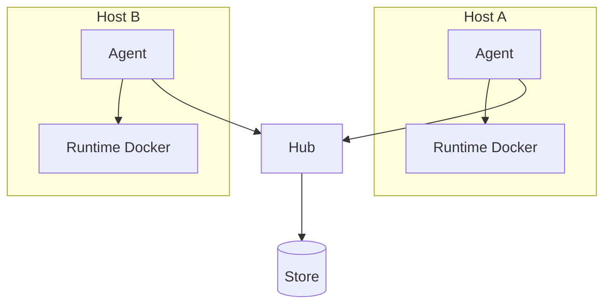
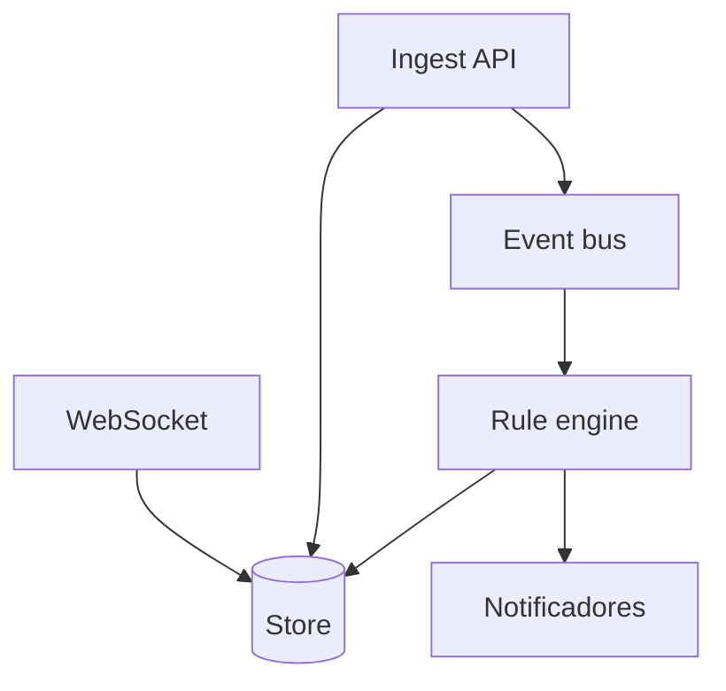
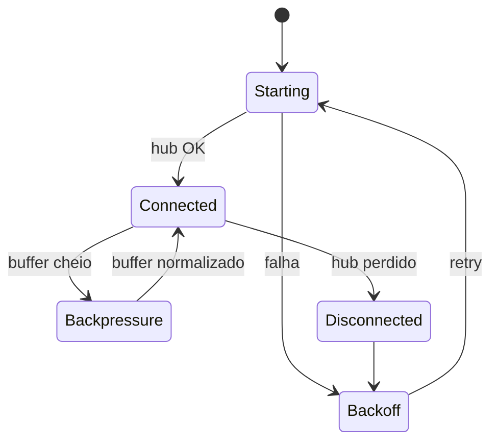

# Visão geral

O Argus separa **coleta** (agent) de **agregação e regras** (hub). Tudo que transita entre eles usa envelopes estáveis com labels e `entity_uid`, para métricas, logs e eventos compartilharem o mesmo vocabulário de filtro.

## Topologia



## Camadas do hub



## Entidade de workload

Cada sinal referencia uma entidade:

```
entity_uid = {runtime}:{host}:{workload_id}
```

Exemplo: `docker:vps-01:api-gateway`

Labels comuns: `host`, `runtime`, `container`, `namespace`, `pod`, `service`.

## Estados do agent



## Próximos fluxos

- [agent-connection.md](flows/agent-connection.md)
- [metrics-ingestion.md](flows/metrics-ingestion.md)
- [log-streaming.md](flows/log-streaming.md)
- [events-and-alerts.md](flows/events-and-alerts.md)
