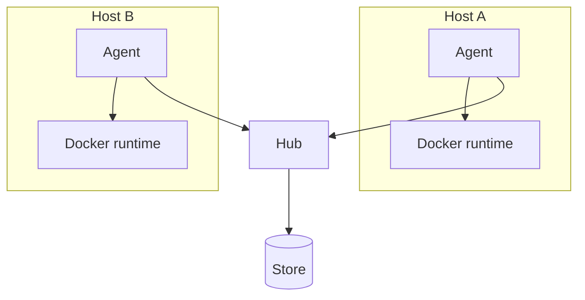
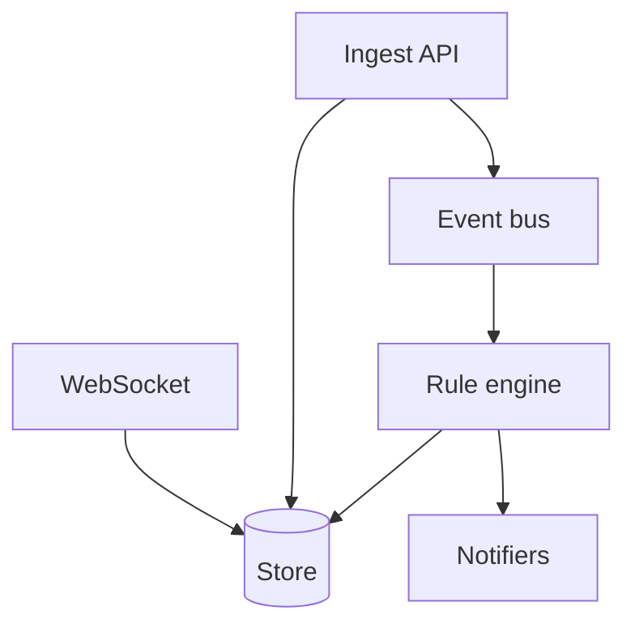
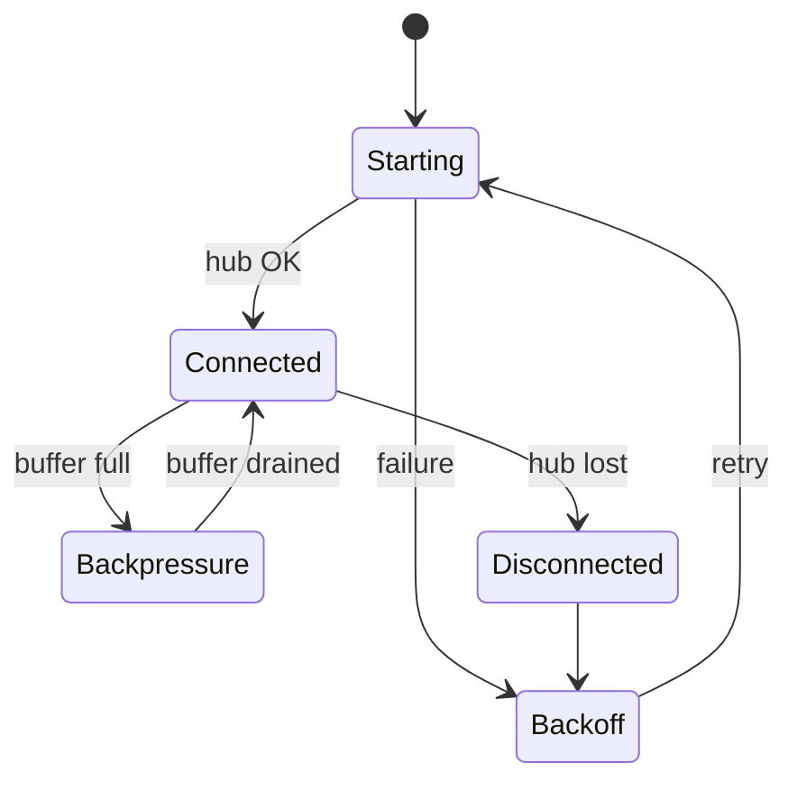

# Overview

Argus splits **collection** (agent) from **aggregation and rules** (hub). Everything that moves between them uses stable envelopes with labels and `entity_uid`, so metrics, logs, and events share the same filter vocabulary.

## Topology


```mermaid
flowchart TB
  subgraph hostA [Host A]
    A1[Agent]
    D1[Docker runtime]
    A1 --> D1
  end
  subgraph hostB [Host B]
    A2[Agent]
    D2[Docker runtime]
    A2 --> D2
  end
  Hub[Hub]
  Store[(Store)]
  A1 --> Hub
  A2 --> Hub
  Hub --> Store
```

## Hub layers


```mermaid
flowchart TB
  Ingest[Ingest API]
  WS[WebSocket]
  Bus[Event bus]
  Rules[Rule engine]
  Store[(Store)]
  Ingest --> Store
  Ingest --> Bus
  Bus --> Rules
  Rules --> Store
  Rules --> Notify[Notifiers]
  WS --> Store
```

## Workload entity

Every signal points at an entity:

```
entity_uid = {runtime}:{host}:{workload_id}
```

Example: `docker:vps-01:api-gateway`

Common labels: `host`, `runtime`, `container`, `namespace`, `pod`, `service`.

## Agent states


```mermaid
stateDiagram-v2
  [*] --> Starting
  Starting --> Connected: hub OK
  Starting --> Backoff: failure
  Backoff --> Starting: retry
  Connected --> Backpressure: buffer full
  Backpressure --> Connected: buffer drained
  Connected --> Disconnected: hub lost
  Disconnected --> Backoff
```

## Next flows

- [agent-connection.md](flows/agent-connection.md)
- [metrics-ingestion.md](flows/metrics-ingestion.md)
- [log-streaming.md](flows/log-streaming.md)
- [events-and-alerts.md](flows/events-and-alerts.md)
