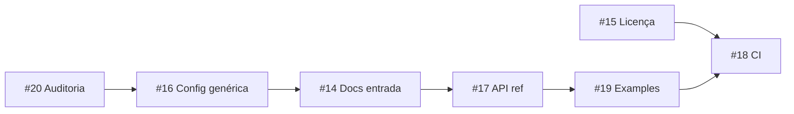

# Roadmap — biblioteca pública

Épico pai: [#13 Biblioteca pública](https://github.com/HarryRaddatz/argus-observability/issues/13)

Ordem sugerida:

## Sub-issues

| Issue | Título | Entregáveis | Depende de |
|---|---|---|---|
| [#20](https://github.com/HarryRaddatz/argus-observability/issues/20) | Auditoria anti-vazamento | grep, fixes, rule | — |
| [#16](https://github.com/HarryRaddatz/argus-observability/issues/16) | Config e seeds genéricos | `.env.example`, SLO `demo-api` | #20 |
| [#14](https://github.com/HarryRaddatz/argus-observability/issues/14) | Docs de entrada | README, CONTRIBUTING, conduct | #16 |
| [#17](https://github.com/HarryRaddatz/argus-observability/issues/17) | API reference | `docs/api/*` | #14 |
| [#19](https://github.com/HarryRaddatz/argus-observability/issues/19) | Examples | `examples/` | #17 |
| [#15](https://github.com/HarryRaddatz/argus-observability/issues/15) | Licença e versionamento | LICENSE, CHANGELOG, v0.1.0 | #14 |
| [#18](https://github.com/HarryRaddatz/argus-observability/issues/18) | CI público | GitHub Actions | #15, #19 |

## Critérios de “biblioteca pública pronta”

1. Clone + `docker compose up` sem contexto externo
2. Zero infra privada no tree (#20)
3. API em `docs/api/`
4. CI verde em PRs
5. Licença + CHANGELOG desde v0.1.0

| [#21](https://github.com/HarryRaddatz/argus-observability/issues/21) | IA e layout do painel | sidebar agrupado, shell de página | — |
| [#22](https://github.com/HarryRaddatz/argus-observability/issues/22) | Gráficos de infraestrutura | grid, meters, stacked charts | #21 (layout) |

Mapa do produto: [../map.md](../map.md)
