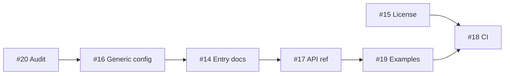

# Roadmap — public library

Parent epic: [#13 Public library](https://github.com/HarryRaddatz/argus-observability/issues/13)

Suggested order:

```mermaid
flowchart LR
  T20[#20 Audit] --> T16[#16 Generic config]
  T16 --> T14[#14 Entry docs]
  T14 --> T17[#17 API ref]
  T17 --> T19[#19 Examples]
  T15[#15 License] --> T18[#18 CI]
  T19 --> T18
```

## Sub-issues

| Issue | Title | Deliverables | Depends on |
|---|---|---|---|
| [#20](https://github.com/HarryRaddatz/argus-observability/issues/20) | Anti-leak audit | grep, fixes, rule | — |
| [#16](https://github.com/HarryRaddatz/argus-observability/issues/16) | Generic config and seeds | `.env.example`, SLO `demo-api` | #20 |
| [#14](https://github.com/HarryRaddatz/argus-observability/issues/14) | Entry docs | README, CONTRIBUTING, conduct | #16 |
| [#17](https://github.com/HarryRaddatz/argus-observability/issues/17) | API reference | `docs/api/*` | #14 |
| [#19](https://github.com/HarryRaddatz/argus-observability/issues/19) | Examples | `examples/` | #17 |
| [#15](https://github.com/HarryRaddatz/argus-observability/issues/15) | License and versioning | LICENSE, CHANGELOG, v0.1.0 | #14 |
| [#18](https://github.com/HarryRaddatz/argus-observability/issues/18) | Public CI | GitHub Actions | #15, #19 |

## Criteria for “public library ready”

1. Clone + `docker compose up` with no external context
2. Zero private infra in the tree (#20)
3. API in `docs/api/`
4. Green CI on PRs
5. License + CHANGELOG since v0.1.0

| [#21](https://github.com/HarryRaddatz/argus-observability/issues/21) | Panel IA and layout | grouped sidebar, page shell | — |
| [#22](https://github.com/HarryRaddatz/argus-observability/issues/22) | Infrastructure charts | grid, meters, stacked charts | #21 (layout) |

Product map: [../map.md](../map.md)
